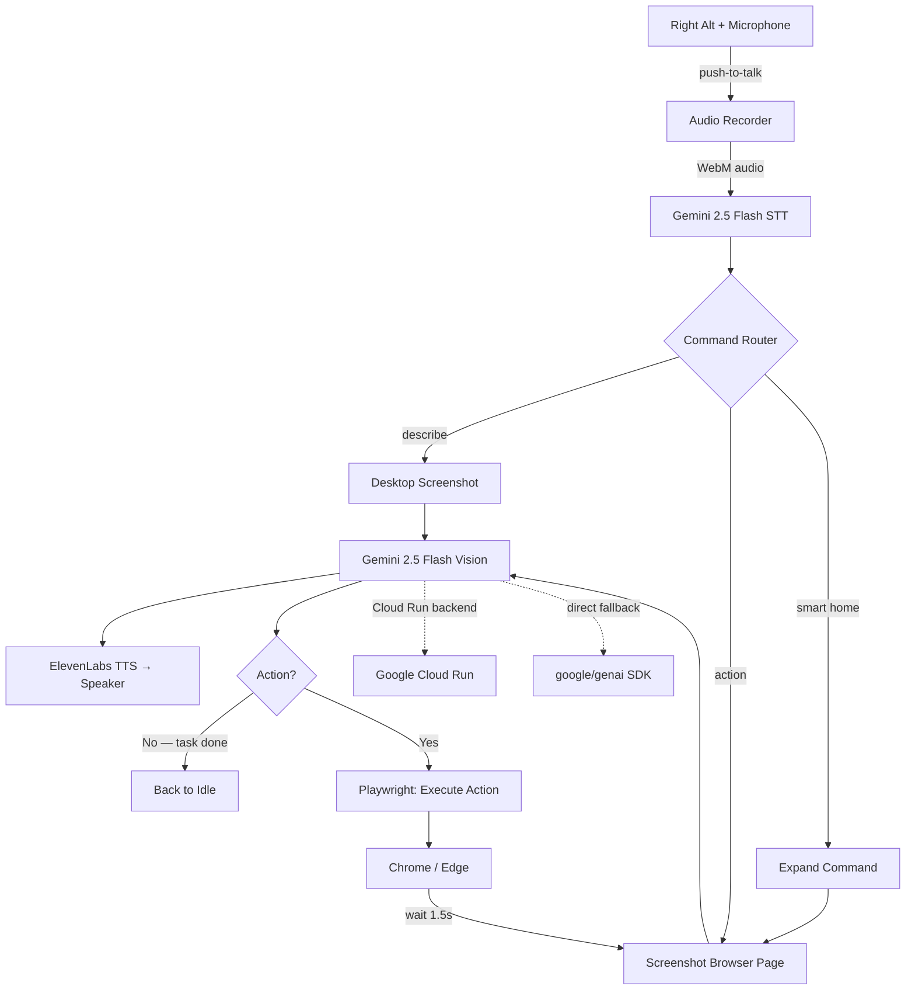

<p align="center">
  
</p>

<h1 align="center">Sally — The AI Screen Reader That Sees, Understands, and Acts</h1>

<p align="center">
  <strong>Built for the Gemini Live Agent Challenge | UI Navigator Track</strong><br/>
  Powered by Gemini 2.5 Flash, Google Cloud Run, and the <code>@google/genai</code> SDK
</p>

---

Sally is a **voice-first accessibility agent** for people with motor impairments, repetitive strain injuries, cognitive disabilities, or anyone who wants faster, hands-free web interaction. It lets people control any website using only their voice, no mouse, no keyboard, no complex navigation required.

**The killer feature: "What do I see?"** Hold the push-to-talk key, ask the question, and Sally captures a screenshot, sends it to **Gemini 2.5 Flash** for multimodal vision analysis, and speaks back a natural-language description of what's on screen.

## How It Works

```
Voice Command ──► Gemini STT ──► Intent Router
                                      │
                        ┌──────────────┼──────────────┐
                        ▼              ▼              ▼
                  "What do I see?"  "Click X"    "Search for Y"
                        │              │              │
                        ▼              ▼              ▼
                  Gemini Vision   Agentic Loop    Agentic Loop
                  (describe)    (Playwright)    (Playwright)
                        │              │              │
                        └──────────────┼──────────────┘
                                       ▼
                                 ElevenLabs TTS
                                       ▼
                                 Spoken Response
```

### The Agentic Loop

For action commands ("open google.com", "search for weather"), Sally runs a **Gemini Vision + Playwright agentic loop**:

1. **Screenshot** the browser page via Playwright
2. **Send to Gemini** — "What do you see? What's the next action?"
3. **Execute** the action (navigate, click, fill, type, select, press, hover, scroll, scroll_up, back, wait)
4. **Narrate** each step aloud via TTS
5. **Repeat** until the task is complete (or max 15 iterations / 3 min timeout)

This means Sally can handle multi-step tasks like "go to google.com and search for accessibility tools" autonomously — navigating, typing, pressing Enter, and describing results.

## Voice Flow

1. **User speaks** — Global push-to-talk hotkey (Right Alt, or Right Option on macOS) captures audio system-wide
2. **Gemini transcribes** — Audio sent to Gemini 2.5 Flash for speech-to-text (no OpenAI dependency)
3. **Gemini sees** — Screenshot sent to Gemini 2.5 Flash for visual understanding
4. **Playwright acts** — Direct browser automation based on Gemini's action plan
5. **Sally speaks** — ElevenLabs neural TTS narrates every action and result
6. **Loop continues** — Take new screenshot, ask Gemini again, until task is done

## Architecture



Want the full system walkthrough? See [docs/architecture.md](./docs/architecture.md) for the detailed architecture, data flow, and implementation notes.

## Google Cloud Architecture

| Component | Service | Purpose |
|-----------|---------|---------|
| **Vision Backend** | Google Cloud Run | Hosts the Gemini screen interpretation proxy |
| **AI Model** | Gemini 2.5 Flash | Multimodal vision — understands screenshots and generates structured actions |
| **SDK** | `@google/genai` | Official Google Gen AI SDK for Node.js |
| **Build** | Cloud Build | Builds container images on deploy |
| **Registry** | Artifact Registry | Stores built container images |

The Cloud Run backend receives a base64 PNG screenshot + user instruction, calls Gemini 2.5 Flash with multimodal input, and returns structured JSON:

```json
{
  "narration": "I see a Google search page with a search box in the center.",
  "action": { "type": "click", "selector": "[aria-label='Search']" }
}
```

## Features

- **Gemini-powered screen understanding** — "What do I see?" uses Gemini 2.5 Flash multimodal vision
- **Voice-first interaction** — Push-to-talk with Gemini STT, every response spoken via TTS
- **Agentic browser automation** — Gemini Vision + Playwright in a loop: screenshot → think → act → repeat
- **Real-time narration** — Every action Sally takes is narrated aloud so the user always knows what's happening
- **Smart selector fallbacks** — CSS → visible text → ARIA role → label → placeholder
- **Multi-step task completion** — Handles complex tasks autonomously across multiple pages
- **Floating assistant bar** — Minimal, non-intrusive UI with live state feedback
- **Configurable settings** — Manage Gemini, Whisper fallback, backend URL, and audio from the settings window

## Getting Started

### Prerequisites

For the full platform, use Node.js 20+.

You'll need API keys for:
- Gemini is required for vision, browser automation, and the default speech-to-text path.
- ElevenLabs is required for text-to-speech.
- OpenAI is optional and only used for Whisper fallback transcription.

### Desktop App

Run `npm run verify:desktop` after installing dependencies to confirm the Node version, native hotkey module, and browser automation prerequisites.

```bash
# Install dependencies
npm install

# Start the app in development mode
npm run dev
```

Configure API keys in the Settings window, or set them in a `.env` file:

On Windows PowerShell, use `Copy-Item .env.example .env` instead of `cp`.

```bash
cp .env.example .env
# Optional: add OPENAI_API_KEY if you want Whisper fallback
# Edit .env with your API keys
```

### Cloud Run Backend Deployment (Optional)

The Sally Vision Backend runs on Google Cloud Run and proxies Gemini API calls. (This is optional — Sally falls back to direct Gemini API calls if the backend is unavailable.)

```bash
cd sally-backend

# Set your Gemini API key
export GEMINI_API_KEY=<your-gemini-api-key>

# Deploy to Cloud Run (requires gcloud CLI)
./deploy.sh

# Or deploy manually:
gcloud run deploy sally-backend \
  --source . --platform managed \
  --region us-central1 --allow-unauthenticated \
  --set-env-vars "GEMINI_API_KEY=${GEMINI_API_KEY}"
```

After deploying, copy the Cloud Run URL and paste it into Sally's Settings > Sally Vision Backend URL field.

## Reproducible Testing Instructions

Follow these steps to verify Sally works end-to-end on your machine.

### Prerequisites

| Requirement | Details |
|---|---|
| **Node.js** | v18+ ([download](https://nodejs.org/)) |
| **Google Chrome** | Installed at default location |
| **Gemini API Key** | Free from [Google AI Studio](https://aistudio.google.com/apikey) |
| **ElevenLabs API Key** | Free tier from [elevenlabs.io](https://elevenlabs.io/) |
| **Microphone** | Any working mic for voice input |
| **OS** | Windows 10/11 (primary), macOS supported |

Use Node.js 20+ for the full repo, and make sure Chrome, Chromium, or Edge is installed locally for Playwright automation.

### Setup (< 3 minutes)

```bash
# 1. Clone and install
git clone https://github.com/manoj7ar/sally.git
cd sally
npm install
npm run verify:desktop

# 2. Configure API keys (Gemini + ElevenLabs required, OpenAI optional for Whisper fallback)

# Option A: Environment file
cp .env.example .env
# Edit .env → set GEMINI_API_KEY and ELEVENLABS_API_KEY

# Option B: Set keys in the app UI after launching (Settings window)

# 3. Close Chrome if it's running (Sally uses your Chrome profile)

# 4. Start the app
npm run dev
```

### Test Scenarios

Run these in order to verify all features work:

**Test 1 — Screen Description (Gemini Vision)**
```
Hold Right Alt → say "What do I see?" → release
Expected: Sally describes what's currently on your screen
Verifies: Gemini multimodal vision, STT, TTS
```

**Test 2 — Navigation (Playwright)**
```
Hold Right Alt → say "Open google.com" → release
Expected: Chrome launches and navigates to Google
Verifies: Playwright browser automation, agentic loop
```

**Test 3 — Multi-step Task (Agentic Loop)**
```
Hold Right Alt → say "Search for accessibility tools on Google" → release
Expected: Sally fills the search box, presses Enter, describes results
Verifies: Multi-step agentic loop with memory, smart selector fallbacks
```

**Test 4 — Smart Home (Web-based)**
```
Hold Right Alt → say "Lights on" → release
Expected: Sally navigates to home.google.com and finds light controls
Verifies: Smart command expansion, Google Home web UI automation
```

**Test 5 — Cancel**
```
During any active task: Hold Right Alt → say "Cancel" → release
Expected: Sally stops immediately and says "Cancelled."
Verifies: Mid-task cancellation
```

**Test 6 — Text Input (Composer)**
```
Click the keyboard icon on the Sally bar → type a command → press Enter
Expected: Same behavior as voice, but via typed text
Verifies: Text-based instruction path
```

### Expected Behavior

- Sally Bar appears at the top of the screen (draggable floating pill)
- Blue border overlay appears when Sally is actively working
- Every action is narrated aloud via TTS
- Chrome opens with your logged-in profile (cookies, sessions preserved)
- The agentic loop runs up to 15 iterations or 3 minutes per task

### Troubleshooting

| Issue | Solution |
|---|---|
| "require is not defined" | Run `npm run build:electron` before `npm run dev` |
| Browser won't launch | Close all Chrome windows first (Chrome locks its profile) |
| No audio / TTS silent | Check ElevenLabs key in Settings, verify speakers are on |
| "Gemini API key" error | Add a key in Settings > AI Model > Gemini API Key, or configure the Sally Vision Backend URL |
| Hotkey not working | Restart the app; on macOS grant Accessibility permission |

Settings note: the current desktop UI exposes Gemini under `AI Model`, with an optional Whisper fallback key in the Voice section.

For a full repo health check, run `npm run check`.

## Tech Stack

| Layer | Technology | Role |
|-------|-----------|------|
| **AI Vision** | **Gemini 2.5 Flash** | Multimodal screen understanding |
| **AI SDK** | **@google/genai** | Google Gen AI SDK for Node.js |
| **Cloud** | **Google Cloud Run** | Serverless backend hosting |
| **Browser** | **Playwright** (`playwright-core`) | Direct browser automation in agentic loop |
| **Desktop** | Electron + React + TypeScript | Cross-platform desktop app |
| **Build** | Vite | Fast frontend bundling |
| **STT** | **Gemini 2.5 Flash** | Speech-to-text transcription with optional OpenAI Whisper fallback |
| **TTS** | ElevenLabs | Neural text-to-speech |
| **Hotkey** | uiohook-napi | Global push-to-talk |

## Repository Structure

Current repo layout after cleanup:
- `electron/` contains the Electron main process, preload bridge, and desktop orchestration.
- `src/` contains the desktop renderer UI.
- `sally-backend/` is the optional Cloud Run Gemini vision backend.
- `shared/` contains cross-process TypeScript types.
- `scripts/` contains repo-level verification helpers.
- `assets/branding/` contains the shared Sally logo asset.
- `config/macos/` contains the macOS packaging entitlements file.
- `docs/architecture.md` contains the detailed architecture write-up.

```text
.
├── electron/              # Electron main process
│   └── main/
│       ├── services/      # TTS, Whisper, Gemini, Playwright, screenshot services
│       ├── managers/      # API keys, session management, microphone
│       └── utils/         # Constants, store
├── src/                   # Desktop renderer UI (React)
│   └── windows/
│       ├── config/        # Settings window
│       ├── sallyBar/      # Floating assistant bar
│       └── borderOverlay/ # Visual feedback overlay
├── sally-backend/         # Cloud Run backend (Gemini vision proxy)
│   ├── index.js           # Express server with @google/genai SDK
│   ├── Dockerfile         # Cloud Run container config
│   └── deploy.sh          # One-command Cloud Run deployment
├── shared/                # Shared TypeScript types
├── docs/                  # Architecture and supporting documentation
│   └── architecture.md   # Detailed system architecture document
└── README.md
```

## Accessibility Mission

Sally exists because the web demands precise motor control such as clicking, scrolling, typing, dragging, that millions of people struggle with. Whether it's a permanent motor impairment like ALS or cerebral palsy, a temporary injury like a broken wrist, or chronic RSI from years of mouse use, the barrier is the same: the web requires hands that work perfectly.

Sally removes that barrier entirely. One voice command replaces dozens of clicks. The goal is not convenience, it's **independence**.

## Built By

Built by [Manoj7ar](https://github.com/Manoj7ar) for the **Gemini Live Agent Challenge 2026**.
