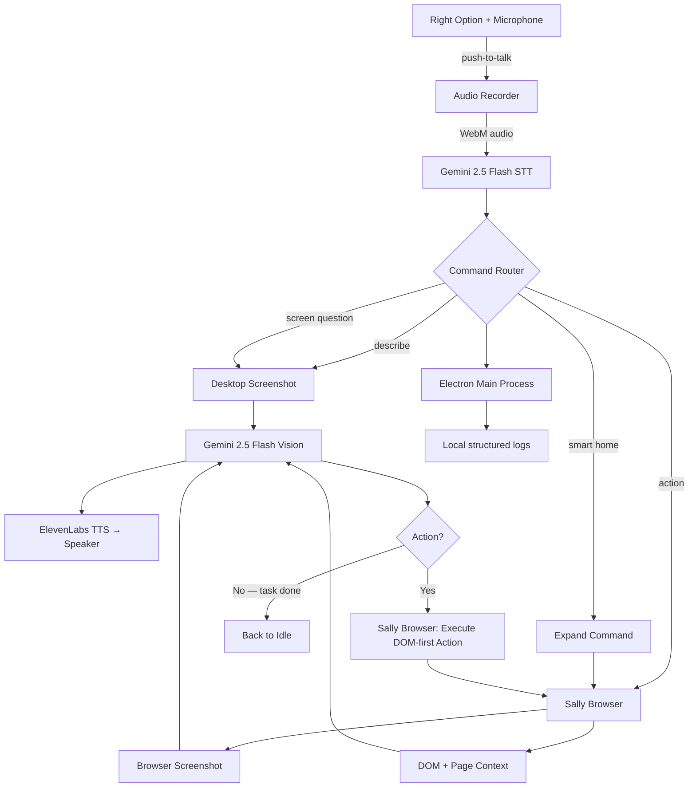

<p align="center">
  
</p>

<h1 align="center">Sally — The AI Screen Reader That Sees, Understands, and Acts</h1>

<p align="center">
  <strong>Built for the Gemini Live Agent Challenge | UI Navigator Track</strong><br/>
  Powered by Gemini 2.5 Flash and the <code>@google/genai</code> SDK (bring your own API key)
</p>

---

Sally is a **voice-first accessibility agent for macOS**. It is built for people with motor impairments, repetitive strain injuries, cognitive disabilities, or anyone who wants faster, hands-free web interaction. It lets people control websites using only their voice, with no mouse, no keyboard, and no complex navigation required.

> **Platform:** Sally runs only on **macOS 11 (Big Sur) or later**. The app refuses to start on Windows or Linux. It uses native macOS APIs (vibrancy, screen-saver window level, AppKit permission prompts, `setContentProtection`, `powerSaveBlocker`, `app.dock`) for a true Mac-first experience.

**The killer feature: "What do I see?"** Hold the push-to-talk key (Right Option), ask the question, and Sally captures a screenshot, sends it to **Gemini 2.5 Flash** for multimodal vision analysis, and speaks back a natural-language description of what's on screen.

**The second killer feature: the Sally browser.** For browser tasks, Sally opens and reuses its own persistent Electron browser window, keeps sessions between launches, captures the live browser screenshot, extracts DOM and page context, and lets Gemini plan one precise next action at a time.

## How It Works

```
Voice Command ──► Gemini STT ──► Intent Router
                                      │
                        ┌──────────────┼──────────────┐
                        ▼              ▼              ▼
                  "What do I see?"  "Click X"    "Search for Y"
                        │              │              │
                        ▼              ▼              ▼
                  Gemini Vision   Agentic Loop    Agentic Loop
                  (describe)   (Sally Browser) (Sally Browser)
                        │              │              │
                        └──────────────┼──────────────┘
                                       ▼
                                 ElevenLabs TTS
                                       ▼
                                 Spoken Response
```

### The Agentic Loop

For action commands like `go to Gmail`, `open Canva`, `click the compose button`, or `search for weather`, Sally runs a **Gemini Vision + DOM-guided agentic loop**:

1. **Open or reuse** the Sally browser on a useful target URL
2. **Screenshot** the current live browser page from Electron `webContents`
3. **Extract DOM and page context** — visible controls, headings, dialogs, messages, focused element
4. **Send to Gemini** — "What do you see? What's the next action?"
5. **Execute** the action (`navigate`, `click`, `fill`, `type`, `select`, `press`, `hover`, `focus`, `check`, `uncheck`, `scroll`, `scroll_up`, `back`, `wait`)
6. **Narrate** each step aloud via TTS
7. **Repeat** until the task is complete, or until **`AGENT_LOOP`** safety limits are hit — **40** iterations or **10 minutes** per task (`electron/main/utils/constants.ts`)

This means Sally can handle multi-step tasks like "go to Gmail and open compose" autonomously — navigating, focusing fields, typing, pressing Enter, and describing results — while staying inside the same persistent Sally browser session.

## Voice Flow

1. **User speaks** — Global push-to-talk (**Right Option**); on first use, grant **Accessibility** in System Settings so the hotkey can register
2. **Gemini transcribes** — Audio sent to Gemini 2.5 Flash for speech-to-text
3. **Intent routes** — Sally decides whether the request is screen-only, visual Q&A, browser assistive help, or a browser control task
4. **Gemini sees** — Sally sends either a desktop screenshot or a browser screenshot plus page context to Gemini 2.5 Flash
5. **Sally acts** — The Sally browser executes DOM-first actions based on Gemini's action plan
6. **Sally speaks** — ElevenLabs neural TTS narrates every action and result
7. **Loop continues** — Take a new screenshot, ask Gemini again, until the task is done

## Architecture



Want the full system walkthrough? See [docs/architecture.md](./docs/architecture.md) for the detailed architecture, data flow, and implementation notes.

## AI configuration

| Piece | What you use |
|-------|----------------|
| **Vision, planning, STT** | Your **Gemini API key** in Settings (same Google AI Studio key for multimodal and speech-to-text) |
| **TTS** | Your **ElevenLabs** API key in Settings |
| **SDK** | `@google/genai` in the Electron main process — calls Google's Gemini API directly |

Example structured response from Gemini for a browser step:

```json
{
  "narration": "I see Gmail with the Compose button on the left.",
  "action": { "type": "click", "selector": "Compose" }
}
```

Structured activity logs are written **locally** (main process logger) only.

## Features

- **Gemini-powered screen understanding** — "What do I see?" uses Gemini 2.5 Flash multimodal vision
- **Voice-first interaction** — Push-to-talk with Gemini STT, every response spoken via TTS
- **Agentic browser automation** — Gemini Vision + DOM-guided browser control in a loop: screenshot → think → act → repeat
- **Persistent Sally browser** — Electron-owned browser session with cookies and login state preserved between launches
- **Real-time narration** — Every action Sally takes is narrated aloud so the user always knows what's happening
- **Structured page grounding** — Gemini sees both the live screenshot and visible page context such as buttons, fields, headings, dialogs, and messages
- **Assistive browser commands** — "What can I do here?", "What buttons are here?", "Read the errors", and similar commands answer directly from the live page
- **Multi-step task completion** — Handles complex tasks autonomously across multiple pages
- **Floating assistant bar** — Minimal, non-intrusive UI with live state feedback
- **Configurable settings** — Manage Gemini, ElevenLabs, and screen-question behavior from the settings window

## Getting Started

### Prerequisites

Sally requires Node.js **20+** and **macOS 11 (Big Sur) or later**. The app refuses to start on any other platform — see the macOS-only entry guard in [`electron/main/index.ts`](electron/main/index.ts) — because the windowing, hotkey registration, content-protection, dock menu, and permissions flow rely on AppKit-only APIs.

You'll need API keys for:
- Gemini is required for vision, browser automation, screen questions, and speech-to-text.
- ElevenLabs is required for text-to-speech.

### Desktop App

Run `npm run verify:desktop` after installing dependencies to confirm the Node version and native hotkey module.

```bash
# Install dependencies
npm install

# Start the app in development mode
npm run dev
```

Configure Gemini and ElevenLabs in the Settings window after launch.

For the desktop app, Sally stores keys in its local settings store. The checked-in `.env.example` is an optional reference for environment-based setup and is not required for the desktop quickstart.

## AI IDE Quickstart

If you're using an AI coding IDE or agent, you can give it the prompt below after cloning the repository locally.

### Suggested Prompt

> Read `README.md` and `docs/architecture.md` fully so you understand the product, architecture, and current codebase before making changes.
>
> Then:
>
> 1. Set up the project locally.
> 2. Install all required dependencies.
> 3. Verify whether the project is fully up to date and working.
> 4. Prefer validating the desktop app end to end.
> 5. Run the appropriate checks, builds, and verification steps.
> 6. Flag anything broken, outdated, duplicated, unnecessary, or inconsistent in the setup or codebase.
>
> Important rules:
>
> - Do **not** ask me for API keys, secrets, or credentials during normal setup.
> - Instead, tell me exactly where I should add them in the app UI for the desktop app.
> - Do **not** invent missing configuration values.
> - Do **not** deploy anything automatically.
> Focus on:
>
> - getting the desktop app working end to end
> - verifying local setup
> - checking for stale docs or broken scripts
> - keeping the repo clean

## Verification

```bash
npm run check
```

## Reproducible Testing Instructions

Follow these steps to verify Sally works end-to-end on your machine.

### Prerequisites

| Requirement | Details |
|---|---|
| **Node.js** | v20+ ([download](https://nodejs.org/)) |
| **Gemini API Key** | Free from [Google AI Studio](https://aistudio.google.com/apikey) |
| **ElevenLabs API Key** | Free tier from [elevenlabs.io](https://elevenlabs.io/) |
| **Microphone** | Any working mic for voice input |
| **OS** | **macOS 11+** (required) |

Use Node.js 20+. No separate external Chrome or Playwright prerequisite is required for the Sally browser path.

### Setup (< 3 minutes)

```bash
# 1. Clone and install
git clone https://github.com/manoj7ar/sally.git
cd sally
npm install
npm run verify:desktop

# 2. Start the app
npm run dev

# 3. In the Settings window, add:
# - Gemini API Key
# - ElevenLabs API Key
```

### Test Scenarios

Run these in order to verify all features work:

**Test 1 — Screen Description (Gemini Vision)**
```
Hold Right Option → say "What am I looking at?" → release
Expected: Sally describes what's currently on your screen
Verifies: Gemini multimodal vision, STT, TTS
```

**Test 2 — Navigation (Sally Browser)**
```
Hold Right Option → say "Go to Gmail" → release
Expected: Sally browser opens and navigates directly to Gmail or the most relevant Gmail destination
Verifies: Electron browser runtime, navigation resolution, agentic loop
```

**Test 3 — Multi-step Task (Agentic Loop)**
```
Hold Right Option → say "Search for accessibility tools on Google" → release
Expected: Sally opens search, fills the query, presses Enter, and describes results
Verifies: Multi-step agentic loop with memory, page-context grounding, DOM-first actions
```

**Test 4 — Browser Assistive Help**
```
With a page open in Sally browser: Hold Right Option → say "What can I do here?" → release
Expected: Sally describes visible controls or actions on the current page
Verifies: DOM/page-context extraction, assistive path
```

**Test 5 — Screen Question**
```
Hold Right Option → say "How many people are on this page?" → release
Expected: Sally answers from the visible screenshot
Verifies: visual Q&A route, Gemini screenshot understanding
```

**Test 6 — Cancel**
```
During any active task: Hold Right Option → say "Cancel" → release
Expected: Sally stops immediately and says "Cancelled."
Verifies: Mid-task cancellation
```

**Test 7 — Text Input (Composer)**
```
Click the keyboard icon on the Sally bar → type a command → press Enter
Expected: Same behavior as voice, but via typed text
Verifies: Text-based instruction path
```

### Expected Behavior

- Sally Bar appears at the top of the screen (draggable floating pill)
- Blue border overlay appears when Sally is actively working
- When Sally is waiting for a reply, the browser blurs fully and shows a centered `Agent is waiting for your reply` message with an `End Agent` cancel button
- Every action is narrated aloud via TTS
- The Sally browser keeps its own cookies and sessions across restarts
- Screen-only commands do not open the browser
- The agentic loop stops after **40** iterations or **10 minutes** per task (`AGENT_LOOP` in `electron/main/utils/constants.ts`)

### Troubleshooting

| Issue | Solution |
|---|---|
| "require is not defined" | Run `npm run build:electron` before `npm run dev` |
| Browser task starts in the wrong place | Retry with a clearer command like `go to Gmail` or `open Canva` |
| No audio / TTS silent | Check ElevenLabs key in Settings, verify speakers are on |
| "Gemini API key" error | Add a key in Settings > AI Model > Gemini API Key |
| Hotkey not working | Open Settings → **macOS Permissions** card → click **Grant** next to *Accessibility*. The hotkey re-registers automatically as soon as macOS reports access; no restart required. |
| "What do I see?" returns nothing | Open Settings → **macOS Permissions** card → click **Open Settings** next to *Screen Recording* and enable Sally. macOS forces a relaunch the first time. |
| Microphone not heard | Open Settings → **macOS Permissions** card → click **Grant** next to *Microphone*. macOS' permission prompt appears the first time; subsequent denials require opening *System Settings → Privacy & Security → Microphone*. |
| Sally bar is hidden behind another app | Press `Cmd+Shift+Space` to summon the floating bar back to the front from anywhere. |

Settings note: the current desktop UI surfaces a top-of-screen **macOS Permissions** card listing Microphone, Screen Recording, and Accessibility (with deep-links to System Settings), an **Open Sally at login** toggle, the Gemini key under `AI Model`, ElevenLabs + Gemini STT status under `Voice`, and an auto-research toggle for Screen Questions.

For a full repo health check, run `npm run check`.

## Tech Stack

| Layer | Technology | Role |
|-------|-----------|------|
| **AI Vision** | **Gemini 2.5 Flash** | Multimodal screen understanding |
| **AI SDK** | **@google/genai** | Google Gen AI SDK for Node.js |
| **Cloud** | *(none required)* | Gemini and ElevenLabs are called directly from the desktop app |
| **Browser** | **Electron BrowserWindow + webContents** | Persistent Sally browser and DOM-first browser control |
| **Desktop** | Electron + React + TypeScript | **macOS-only** host (vibrancy, screen-saver window level, NSStatusItem-grade dock menu, AppKit permission prompts) |
| **Build** | Vite | Renderer bundling |
| **STT** | **Gemini 2.5 Flash** | Speech-to-text transcription (`transcriptionService.ts`) |
| **TTS** | ElevenLabs | Neural text-to-speech |
| **Hotkey** | uiohook-napi | Global push-to-talk (**Right Option**) |

## Repository Structure

Current repo layout after cleanup:
- `electron/` contains the Electron main process, preload bridge, and desktop orchestration.
- `src/` contains the desktop renderer UI.
- `shared/` contains cross-process TypeScript types.
- `scripts/` contains repo-level verification helpers.
- `assets/branding/` contains the shared Sally logo asset.
- `config/macos/` contains the macOS packaging entitlements file.
- `docs/architecture.md` contains the detailed architecture write-up.

```text
.
├── electron/              # Electron main process
│   └── main/
│       ├── services/      # Transcription, TTS, Gemini, browser, screenshot services
│       ├── managers/      # API keys, session management, microphone
│       └── utils/         # Constants, store
├── src/                   # Desktop renderer UI (React)
│   └── windows/
│       ├── config/        # Settings window
│       ├── sallyBar/      # Floating assistant bar
│       └── borderOverlay/ # Visual feedback overlay
├── shared/                # Shared TypeScript types
├── docs/                  # Architecture and supporting documentation
│   └── architecture.md    # Detailed system architecture document
└── README.md
```

## Accessibility Mission

Sally exists because the web demands precise motor control such as clicking, scrolling, typing, dragging, that millions of people struggle with. Whether it's a permanent motor impairment like ALS or cerebral palsy, a temporary injury like a broken wrist, or chronic RSI from years of mouse use, the barrier is the same: the web requires hands that work perfectly.

Sally removes that barrier entirely. One voice command replaces dozens of clicks. The goal is not convenience, it's **independence**.

## Built By

Built by [Manoj7ar](https://github.com/Manoj7ar) for the **Gemini Live Agent Challenge 2026**.

