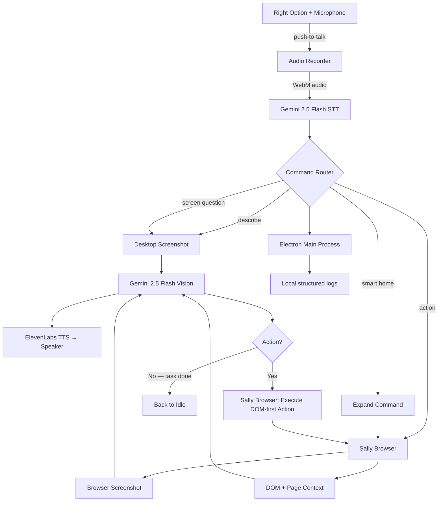

<p align="center">
  
</p>

<h1 align="center">Sally — The AI Screen Reader That Sees, Understands, and Acts</h1>

<p align="center">
  <strong>Built for the Gemini Live Agent Challenge | UI Navigator Track</strong><br/>
  Powered by Gemini 2.5 Flash and the <code>@google/genai</code> SDK (bring your own API key)
</p>

---

Sally is a **voice-first accessibility agent for macOS**. It is built for people with motor impairments, repetitive strain injuries, cognitive disabilities, or anyone who wants faster, hands-free web interaction. It lets people control websites using only their voice, with no mouse, no keyboard, and no complex navigation required.

> **Platform:** Sally runs only on **macOS 11 (Big Sur) or later**. The app refuses to start on Windows or Linux. It uses native macOS APIs (vibrancy, screen-saver window level, AppKit permission prompts, `setContentProtection`, `powerSaveBlocker`, `app.dock`) for a true Mac-first experience.

**The killer feature: "What do I see?"** Hold the push-to-talk key (Right Option), ask the question, and Sally captures a screenshot, sends it to **Gemini 2.5 Flash** for multimodal vision analysis, and speaks back a natural-language description of what's on screen.

**The second killer feature: the Sally browser.** For browser tasks, Sally opens and reuses its own persistent Electron browser window, keeps sessions between launches, captures the live browser screenshot, extracts DOM and page context, and lets Gemini plan one precise next action at a time.

## How It Works

```
Voice Command ──► Gemini STT ──► Intent Router
                                      │
                        ┌──────────────┼──────────────┐
                        ▼              ▼              ▼
                  "What do I see?"  "Click X"    "Search for Y"
                        │              │              │
                        ▼              ▼              ▼
                  Gemini Vision   Agentic Loop    Agentic Loop
                  (describe)   (Sally Browser) (Sally Browser)
                        │              │              │
                        └──────────────┼──────────────┘
                                       ▼
                                 ElevenLabs TTS
                                       ▼
                                 Spoken Response
```

### The Agentic Loop

For action commands like `go to Gmail`, `open Canva`, `click the compose button`, or `search for weather`, Sally runs a **Gemini Vision + DOM-guided agentic loop**:

1. **Open or reuse** the Sally browser on a useful target URL
2. **Screenshot** the current live browser page from Electron `webContents`
3. **Extract DOM and page context** — visible controls, headings, dialogs, messages, focused element
4. **Send to Gemini** — "What do you see? What's the next action?"
5. **Execute** the action (`navigate`, `click`, `fill`, `type`, `select`, `press`, `hover`, `focus`, `check`, `uncheck`, `scroll`, `scroll_up`, `back`, `wait`)
6. **Narrate** each step aloud via TTS
7. **Repeat** until the task is complete, or until **`AGENT_LOOP`** safety limits are hit — **40** iterations or **10 minutes** per task (`electron/main/utils/constants.ts`)

This means Sally can handle multi-step tasks like "go to Gmail and open compose" autonomously — navigating, focusing fields, typing, pressing Enter, and describing results — while staying inside the same persistent Sally browser session.

## Voice Flow

1. **User speaks** — Global push-to-talk (**Right Option**); on first use, grant **Accessibility** in System Settings so the hotkey can register
2. **Gemini transcribes** — Audio sent to Gemini 2.5 Flash for speech-to-text
3. **Intent routes** — Sally decides whether the request is screen-only, visual Q&A, browser assistive help, or a browser control task
4. **Gemini sees** — Sally sends either a desktop screenshot or a browser screenshot plus page context to Gemini 2.5 Flash
5. **Sally acts** — The Sally browser executes DOM-first actions based on Gemini's action plan
6. **Sally speaks** — ElevenLabs neural TTS narrates every action and result
7. **Loop continues** — Take a new screenshot, ask Gemini again, until the task is done

## Architecture



Want the full system walkthrough? See [docs/architecture.md](./docs/architecture.md) for the detailed architecture, data flow, and implementation notes.

## AI configuration

| Piece | What you use |
|-------|----------------|
| **Vision, planning, STT** | Your **Gemini API key** in Settings (same Google AI Studio key for multimodal and speech-to-text) |
| **TTS** | Your **ElevenLabs** API key in Settings |
| **SDK** | `@google/genai` in the Electron main process — calls Google's Gemini API directly |

Example structured response from Gemini for a browser step:

```json
{
  "narration": "I see Gmail with the Compose button on the left.",
  "action": { "type": "click", "selector": "Compose" }
}
```

Structured activity logs are written **locally** (main process logger) only.

## Features

- **Gemini-powered screen understanding** — "What do I see?" uses Gemini 2.5 Flash multimodal vision
- **Voice-first interaction** — Push-to-talk with Gemini STT, every response spoken via TTS
- **Agentic browser automation** — Gemini Vision + DOM-guided browser control in a loop: screenshot → think → act → repeat
- **Persistent Sally browser** — Electron-owned browser session with cookies and login state preserved between launches
- **Real-time narration** — Every action Sally takes is narrated aloud so the user always knows what's happening
- **Structured page grounding** — Gemini sees both the live screenshot and visible page context such as buttons, fields, headings, dialogs, and messages
- **Assistive browser commands** — "What can I do here?", "What buttons are here?", "Read the errors", and similar commands answer directly from the live page
- **Multi-step task completion** — Handles complex tasks autonomously across multiple pages
- **Floating assistant bar** — Minimal, non-intrusive UI with live state feedback
- **Configurable settings** — Manage Gemini, ElevenLabs, and screen-question behavior from the settings window

