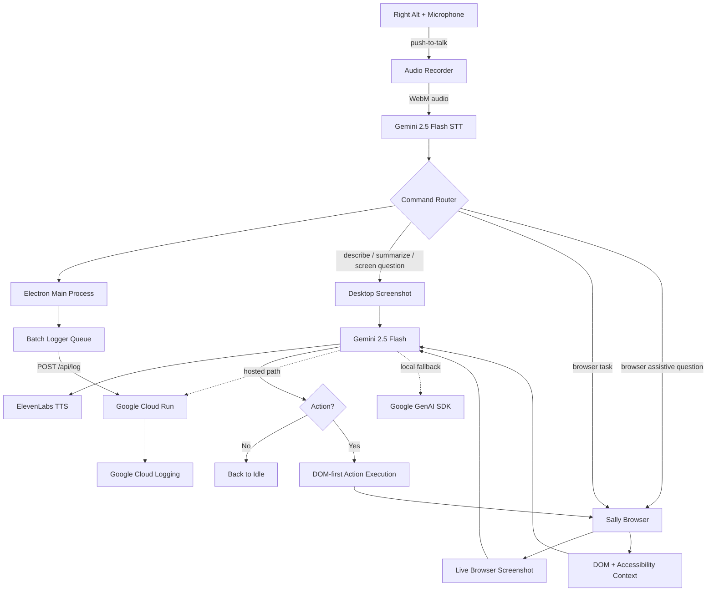
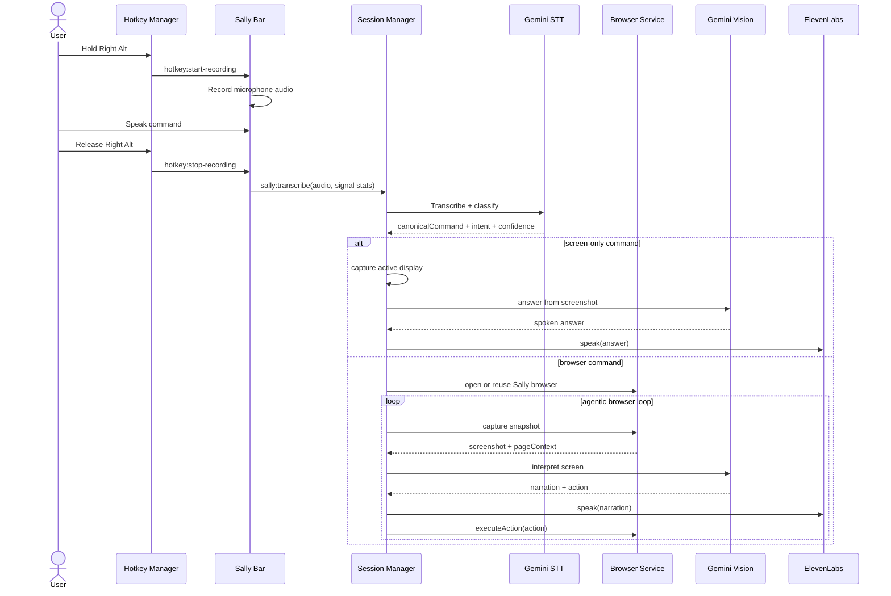
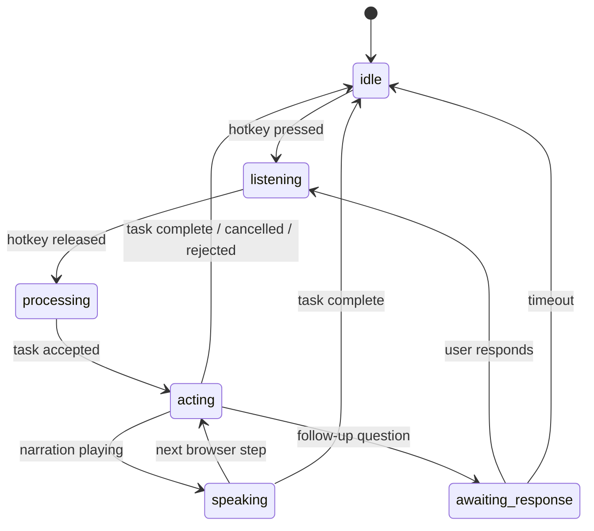
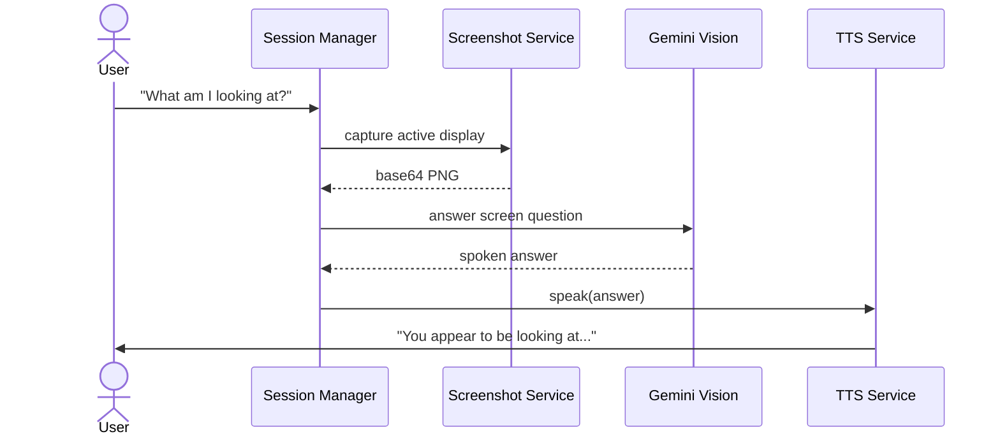
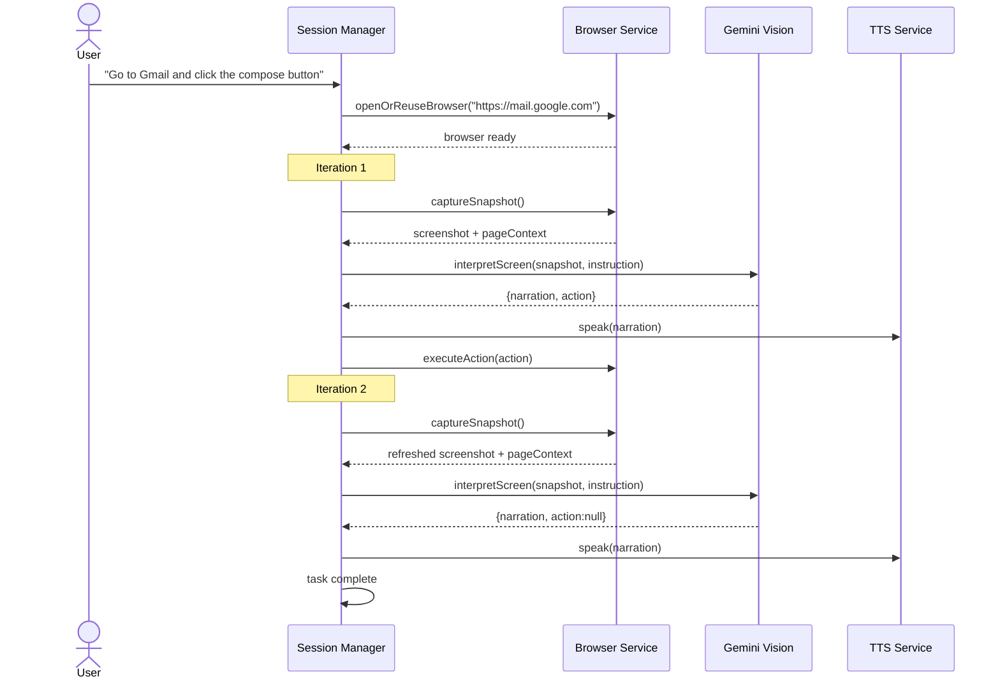
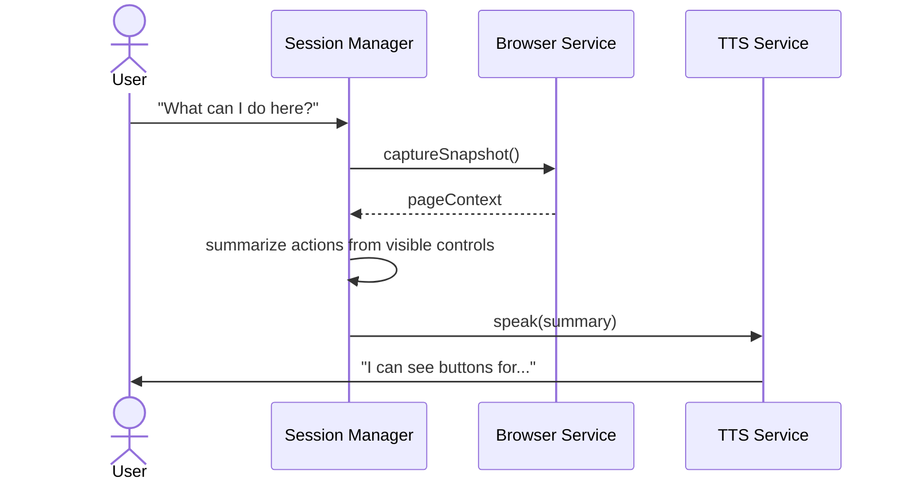
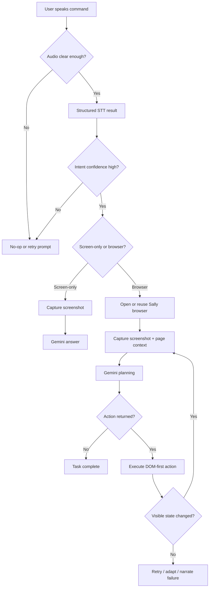

# Sally — Complete System Architecture

> **Gemini Live Agent Challenge 2026 | UI Navigator Track | Accessibility Focus**
>
> *"The AI assistant that sees, understands, and acts — so you don't have to click."*
>
> Sally lets people with motor impairments, RSI, cognitive disabilities, or anyone who wants hands-free web control use websites with just their voice. It combines Gemini's multimodal vision, push-to-talk input, a persistent Electron-owned browser with DOM access, and ElevenLabs neural TTS in a single, continuous control loop.

---

## Table of Contents

1. [The Big Picture — Plain English](#1-the-big-picture--plain-english)
2. [Why Sally Exists — The Problem](#2-why-sally-exists--the-problem)
3. [How Sally Solves It — The Solution Loop](#3-how-sally-solves-it--the-solution-loop)
4. [System Components Overview](#4-system-components-overview)
5. [High-Level Architecture Diagram](#5-high-level-architecture-diagram)
6. [Voice Flow — Step by Step](#6-voice-flow--step-by-step)
7. [Gemini Vision Pipeline](#7-gemini-vision-pipeline)
8. [Cloud Run Backend — Deep Dive](#8-cloud-run-backend--deep-dive)
9. [Electron App Architecture](#9-electron-app-architecture)
10. [Electron Browser Agentic Loop — DOM + Screenshot Control](#10-electron-browser-agentic-loop--dom--screenshot-control)
11. [IPC Communication Layer](#11-ipc-communication-layer)
12. [Session State Machine](#12-session-state-machine)
13. [Provider System — Gemini-First Architecture](#13-provider-system--gemini-first-architecture)
14. [Data Flow — Every Byte, Every Step](#14-data-flow--every-byte-every-step)
15. [Google Cloud Deployment](#15-google-cloud-deployment)
16. [Security Architecture](#16-security-architecture)
17. [Component File Map](#17-component-file-map)
18. [Hackathon Judging Alignment](#18-hackathon-judging-alignment)
19. [Sequence Diagrams — Real Scenarios](#19-sequence-diagrams--real-scenarios)
20. [Error Handling & Fallback Paths](#20-error-handling--fallback-paths)

---

## 1. The Big Picture — Plain English

Imagine you have a motor impairment, RSI flare-up, or even a broken wrist. You want to get into Gmail, open compose, read the page, and move through the interface without touching a mouse. Modern websites make that harder than it should be. They hide controls behind menus, dialogs, popovers, sidebars, and tiny buttons that demand precise physical interaction.

**Sally changes that interaction model.**

You press and hold the Right Alt key on Windows or Right Option on macOS. You say: *"Go to Gmail and click the compose button."* You release the key.

Sally then:

1. **Hears you** — records your voice through push-to-talk
2. **Understands you** — transcribes the command using Gemini 2.5 Flash
3. **Routes the task** — decides whether this is a screen question, summary, browser assistive command, or browser action task
4. **Opens or reuses Sally browser** — a persistent Electron-owned browser window with saved cookies and sessions
5. **Looks at the page** — captures the live browser screenshot and extracts DOM/page context
6. **Thinks one step at a time** — sends screenshot + context + instruction to Gemini 2.5 Flash
7. **Speaks back** — ElevenLabs narrates what Sally sees and what it is doing
8. **Acts on the page** — clicks, fills, focuses, types, checks, scrolls, and navigates directly in the live DOM
9. **Loops until done** — captures a fresh screenshot, asks Gemini for the next step, and repeats until the task completes

All of that happens without the user needing to touch the mouse. Sally becomes the user's hands on screen.

---

## 2. Why Sally Exists — The Problem

```text
3.8 million workers suffer RSI annually in the US alone.
1 in 5 people worldwide live with a disability.
Modern websites still assume precise pointer control.
```

The modern web demands repeated physical effort:
- clicking small buttons and links
- typing into exact fields with precise focus
- navigating menus, tabs, accordions, dialogs, and dropdowns
- scrolling through long pages to find the right section
- reacting to validation errors, banners, and state changes

Traditional voice assistants help with simple commands, but they do not reliably understand a full visual web interface, choose the right element, and continue through a task. Meanwhile, fully manual browser automation often opens a fresh session, lands on the wrong page, or loses the user's context.

**Sally exists to bridge that gap.** It is not just a chatbot and not just a browser macro runner. It is a multimodal UI navigator: it sees the interface, understands what is on screen, and executes the next useful action.

---

## 3. How Sally Solves It — The Solution Loop

```text
┌─────────────────────────────────────────────────────────────┐
│                    THE SALLY LOOP                           │
│                                                             │
│  User holds hotkey -> speaks -> releases hotkey            │
│         ↓                                                   │
│  Gemini transcribes audio -> text instruction              │
│         ↓                                                   │
│  Router decides: screen-only or browser task              │
│         ↓                                                   │
│  ┌──► Sally browser captures screenshot + DOM context     │
│  │         ↓                                                │
│  │    Gemini 2.5 Flash -> narration + next action         │
│  │         ↓                                                │
│  │    ElevenLabs speaks narration aloud                    │
│  │         ↓                                                │
│  │    Browser service executes DOM-first action            │
│  │         ↓                                                │
│  └── Verify visible state changed, then loop again         │
│         ↓                                                   │
│  action=null -> task complete, back to idle                │
└─────────────────────────────────────────────────────────────┘
```

The loop is intentionally multimodal:
- **Audio input** via push-to-talk speech
- **Visual input** via screenshot capture
- **Structured grounding** via DOM and accessibility context
- **Audio output** via ElevenLabs narration
- **Physical output** via browser actions in the live page

This is the core idea behind Sally: screenshot understanding plus direct UI control.

---

## 4. System Components Overview

| Component | Technology | Role |
|-----------|-----------|------|
| **Electron Shell** | Electron | Desktop host, windows, IPC, session lifecycle |
| **Hotkey Manager** | `uiohook-napi` | Global push-to-talk hotkey |
| **Audio Recorder** | Web Audio API | Captures mic audio as WebM/Opus |
| **Gemini STT** | Gemini 2.5 Flash | Default transcription and command recovery |
| **Whisper Fallback** | OpenAI Whisper | Optional backup STT path |
| **Screenshot Service** | Electron `desktopCapturer` | Full-screen screenshot capture for desktop questions |
| **Browser Service** | Electron `BrowserWindow` + `webContents` | Persistent Sally browser, screenshots, DOM extraction, DOM-first actions |
| **Page Context Extractor** | Injected DOM scripts | Builds control inventory, headings, landmarks, dialogs, messages |
| **Gemini Service** | `@google/genai` + backend HTTP | Multimodal planning and visual question answering |
| **Cloud Run Backend** | Node.js + Express | Hosted Gemini proxy on Google Cloud |
| **Cloud Logger** | Electron batching + Google Cloud Logging | Optional structured log pipeline for desktop and backend activity |
| **Session Manager** | TypeScript | Main orchestration and state machine |
| **TTS Service** | ElevenLabs API | Neural text-to-speech narration |
| **Config Window** | React | Settings UI for keys, backend, audio, research toggle |
| **Sally Bar** | React | Floating status pill and mic capture surface |
| **Border Overlay** | React | Active-state blue border on the target display |
| **Electron Store** | `electron-store` | Persistent config storage |

---

## 5. High-Level Architecture Diagram



The important change from earlier versions of Sally is the browser ownership model. Instead of starting a separate automation browser for each task, Sally now owns and reuses one persistent Electron browser surface. The local fallback path uses the `@google/genai` SDK directly from the desktop app.

---

## 6. Voice Flow — Step by Step

Every spoken command goes through a structured pipeline.



The STT layer is intentionally conservative:
- silence becomes a no-op
- clipped phrases stay low confidence
- incomplete commands do not launch tasks
- browser navigation phrases get a command-focused retry before final rejection

---

## 7. Gemini Vision Pipeline

### Input

Every Gemini browser-planning call receives:
1. **Screenshot** — base64 PNG of the current live browser page
2. **Instruction** — the user's spoken or typed command
3. **History** — recent actions and narration context
4. **Page URL and title** — current browser location
5. **Structured page context** — interactive controls, headings, landmarks, dialogs, visible messages, active element, and semantic summary
6. **Source mode** — currently `electron_browser`

For screen-only questions, Gemini receives:
1. desktop or browser screenshot
2. the user's visual question
3. optional page context if the question is about a live browser page

### System prompt goals

Gemini is instructed to:
- describe only what matters for the user's goal
- choose one next action at a time
- treat the screenshot as primary truth
- use DOM/page context as grounding for precise targeting
- avoid guessing when the screen is unclear
- set `action` to `null` when the goal is already achieved

### Browser planning JSON schema

```json
{
  "narration": "I can see Gmail with a Compose button on the left.",
  "action": {
    "type": "click",
    "selector": "Compose"
  }
}
```

### Screen-question JSON schema

```json
{
  "answer": "I can see a page showing about ten people with their names underneath.",
  "shouldResearch": false,
  "researchQuery": null
}
```

### Action family

| Type | Fields | Example |
|------|--------|---------|
| `navigate` | `url` | `{"type":"navigate","url":"https://gmail.com"}` |
| `click` | `selector`, `index?` | `{"type":"click","selector":"Compose"}` |
| `fill` | `selector`, `value`, `index?` | `{"type":"fill","selector":"Search","value":"Gemini docs"}` |
| `type` | `value` | `{"type":"type","value":"hello world"}` |
| `select` | `selector`, `value` | `{"type":"select","selector":"Country","value":"United States"}` |
| `press` | `value` | `{"type":"press","value":"Enter"}` |
| `hover` | `selector`, `index?` | `{"type":"hover","selector":"Account menu"}` |
| `focus` | `selector`, `index?` | `{"type":"focus","selector":"Search mail"}` |
| `check` | `selector`, `index?` | `{"type":"check","selector":"Remember me"}` |
| `uncheck` | `selector`, `index?` | `{"type":"uncheck","selector":"Subscribe"}` |
| `scroll` | — | `{"type":"scroll"}` |
| `scroll_up` | — | `{"type":"scroll_up"}` |
| `back` | — | `{"type":"back"}` |
| `wait` | `value?` | `{"type":"wait","value":"1000"}` |

### Special browser-assistive paths

Certain requests bypass the full action loop and answer directly from page context:
- `what can I do here`
- `what buttons are on this page`
- `what form fields are here`
- `what links are here`
- `what headings are here`
- `read the errors`

That keeps common assistive questions fast and deterministic.

---

## 8. Cloud Run Backend — Deep Dive

### Why the backend exists

Sally can call Gemini directly from the desktop app, but the Cloud Run backend gives the project a clean hosted path for the hackathon requirements and a stable place to centralize prompt logic.

### Service configuration

| Setting | Value |
|---------|-------|
| **Runtime** | Node.js on Cloud Run |
| **Framework** | Express.js |
| **Region** | Google Cloud deployment target |
| **Auth** | Public endpoint for the desktop client |
| **Scale** | Scale to zero when idle |
| **Model** | Gemini 2.5 Flash |

### Endpoints

| Endpoint | Purpose |
|----------|---------|
| `GET /health` | Health/status check |
| `POST /api/interpret-screen` | Browser planning |
| `POST /api/answer-screen-question` | Screenshot Q&A |
| `POST /api/log` | Optional structured desktop log ingestion |

### Request contract for browser planning

```json
{
  "screenshot": "<base64-png>",
  "instruction": "Go to Gmail and click the compose button",
  "pageUrl": "https://mail.google.com/",
  "pageTitle": "Gmail",
  "sourceMode": "electron_browser",
  "pageContext": {
    "interactiveElements": [],
    "headings": [],
    "landmarks": [],
    "dialogs": [],
    "visibleMessages": [],
    "activeElement": "",
    "semanticSummary": ""
  }
}
```

### Response contract for browser planning

```json
{
  "narration": "I can see Gmail and the Compose button is available.",
  "action": {
    "type": "click",
    "selector": "Compose"
  }
}
```

The desktop app prefers the backend when configured and falls back to direct Gemini when needed.

### Optional Cloud Logging pipeline

```text
Electron main services
    -> cloudLogger.ts batches structured events
    -> POST /api/log on sally-backend
    -> logger.js writes to sally-agent-log
    -> Google Cloud Logging shows agent activity in Cloud Console
```

This path is intentionally gated:
- backend writes only go to Google Cloud Logging when `ENABLE_CLOUD_LOGGING=true`
- desktop forwarding only leaves the app when the local `cloudLoggingEnabled` store flag is enabled

If either gate is off, Sally falls back to local console logging and the user-facing behavior stays the same.

---

## 9. Electron App Architecture

### Process model

```text
┌─────────────────────────────────────────────┐
│                MAIN PROCESS                 │
│                                             │
│  index.ts          - app lifecycle          │
│  windowManager.ts  - window creation/mgmt   │
│  hotkeyManager.ts  - global keyboard hook   │
│  ipcHandlers.ts    - IPC channel registry   │
│                                             │
│  managers/                                  │
│    sessionManager.ts  - orchestration brain │
│    apiKeyManager.ts   - config + key state  │
│    microphoneManager.ts - mic mute state    │
│                                             │
│  services/                                  │
│    browserService.ts    - Sally browser     │
│    geminiService.ts     - Gemini calls      │
│    whisperService.ts    - STT + recovery    │
│    ttsService.ts        - ElevenLabs TTS    │
│    screenshotService.ts - desktop capture   │
│    pageContext.ts       - DOM extraction    │
│                                             │
│  utils/                                     │
│    constants.ts  - config constants         │
│    store.ts      - Electron Store wrapper   │
└─────────────────────────────────────────────┘
         │ IPC (invoke / broadcast)
         ▼
┌─────────────────────────────────────────────┐
│            RENDERER PROCESSES               │
│                                             │
│  Config Window  - Settings UI               │
│  Sally Bar      - Floating status pill      │
│  Border Overlay - Active-state indicator    │
└─────────────────────────────────────────────┘
```

### Main process responsibilities

The main process owns:
- the browser lifecycle
- the session state machine
- Gemini planning calls
- TTS dispatch
- hotkey handling
- IPC request/response boundaries

### Renderer responsibilities

Renderer windows stay thin:
- collect microphone audio
- render settings and state
- play back TTS audio
- surface live feedback and previews

That split keeps the sensitive automation and API orchestration logic in the main process.

---

## 10. Electron Browser Agentic Loop — DOM + Screenshot Control

### Runtime model

Sally no longer relies on a separately launched Playwright browser as the primary task path.

Instead, `browserService` owns a persistent Electron browser window:
- one Sally browser is reused across tasks
- its session partition persists cookies and local storage
- the same browser can stay logged in across app restarts
- the initial visible page is a useful destination, not a dead blank startup tab

### Why this model is stronger

This browser model removes several problems that appeared in the older approach:
- inconsistent profile locking
- fresh-session behavior on repeated tasks
- unreliable reuse of an external browser
- `about:blank` startup friction

### Loop structure

```text
1. Receive canonical browser instruction
2. Resolve a starting destination when possible
3. Open or reuse Sally browser
4. Capture browser screenshot + page context
5. Ask Gemini for narration + one next action
6. Speak narration
7. Execute action in the live DOM
8. Verify the page changed or settled
9. Repeat until action=null or timeout/cancel
```

### DOM-first action strategy

For actions like `click`, `fill`, `focus`, `check`, and `select`, Sally tries to target the page semantically:

1. role and accessible name
2. label or placeholder
3. visible text match
4. ordinal targeting with `index`
5. focused-element keyboard fallback when appropriate

This is what enables commands like:
- `click the compose button`
- `focus the search box`
- `click the second result`
- `check remember me`

### Browser assistive layer

The browser loop is not the only browser path. Sally also has fast direct-response helpers for:
- `what can I do here`
- `what buttons are on this page`
- `what form fields are here`
- `what links are here`
- `what headings are here`
- `read the errors`

Those commands use the current browser snapshot without asking Gemini to plan a generic action loop first.

---

## 11. IPC Communication Layer

### Invokable channels (Renderer -> Main)

| Channel | Purpose |
|---------|---------|
| `sally:get-config` | Get current config state |
| `sally:set-api-key` | Save provider API keys |
| `sally:clear-api-key` | Remove saved API keys |
| `sally:get-gemini-backend-url` | Get backend URL |
| `sally:set-gemini-backend-url` | Save backend URL |
| `sally:get-elevenlabs-key-status` | Check ElevenLabs key presence |
| `sally:get-gemini-key-status` | Check Gemini key presence |
| `sally:get-whisper-key-status` | Check Whisper fallback key presence |
| `sally:get-audio-device` | Get selected input device |
| `sally:set-audio-device` | Set selected input device |
| `sally:get-mic-muted` | Get mic mute state |
| `sally:set-mic-muted` | Set mic mute state |
| `sally:preview-transcription` | Live speech preview |
| `sally:transcribe` | Final voice transcription and execution |
| `sally:handle-silence` | Explicit silence no-op |
| `sally:send-instruction` | Text instruction path |
| `sally:cancel` | Cancel current task |
| `window:show-config` | Open settings window |
| `window:set-pill-layout` | Resize Sally bar |

### Broadcast channels (Main -> Renderer)

| Channel | Payload | Purpose |
|---------|---------|---------|
| `sally:state-changed` | `{ state }` | State machine transitions |
| `sally:step` | `{ action, details, timestamp }` | Browser/action updates |
| `sally:chat` | `{ role, text }` | Chat messages and answers |
| `sally:tts-audio` | `{ audioBase64 }` | TTS audio playback |
| `sally:mic-muted-changed` | `{ muted }` | Mic mute status |
| `hotkey:start-recording` | - | Push-to-talk key down |
| `hotkey:stop-recording` | - | Push-to-talk key up |
| `hotkey:cancel-recording` | - | Recording cancelled |

IPC is the seam between UI and automation. The renderer never owns browser logic directly; it asks the main process to do it.

---

## 12. Session State Machine



### State to UI mapping

| State | Sally Bar | Border Overlay | TTS |
|-------|-----------|---------------|-----|
| `idle` | Minimal | Hidden | - |
| `listening` | Visible, pulse | Blue border on target display | - |
| `processing` | Visible | Blue border | Optional immediate acknowledgement |
| `acting` | Visible | Blue border | Step narration |
| `speaking` | Visible | Blue border | Active playback |
| `awaiting_response` | Visible | Hidden | Waiting for user |

### Important state protections

- each run has a generation token so stale async work cannot update current state
- pressing push-to-talk during an active run preempts the old run
- silence returns to idle cleanly
- low-confidence transcripts never enter the acting state

---

## 13. Provider System — Gemini-First Architecture

Sally is a Gemini-first app.

| Capability | Provider |
|------------|----------|
| Vision + browser planning | **Gemini 2.5 Flash** |
| Screen questions and summaries | **Gemini 2.5 Flash** |
| Default speech-to-text | **Gemini 2.5 Flash** |
| Optional transcription fallback | **OpenAI Whisper** |
| Text-to-speech | **ElevenLabs** |

### Why Gemini-first matters

The project is built for the Google Gemini Live Agent Challenge, so Gemini is not incidental. It is the central reasoning layer for:
- screen interpretation
- browser action planning
- visual question answering
- conservative command recovery for short voice navigation phrases

The hosted backend and the direct desktop path both center on the same Gemini contracts.

---

## 14. Data Flow — Every Byte, Every Step

### Audio flow

```text
Microphone -> Web Audio API -> WebM/Opus blob -> base64 audio
    -> Gemini STT / fallback STT
    -> structured transcription result
```

Structured result shape:

```json
{
  "transcript": "Go to Gmail",
  "canonicalCommand": "Go to Gmail",
  "intent": "browse_command",
  "confidence": "high",
  "source": "gemini"
}
```

### Browser planning flow

```text
Sally browser page
    -> capturePage() screenshot
    -> extract pageContext from DOM
    -> Gemini planning call
    -> narration + action JSON
    -> ElevenLabs narration
    -> browserService.executeAction()
    -> settle + recapture
```

### Screen-question flow

```text
Active display screenshot or browser screenshot
    -> Gemini screen-question call
    -> answer text
    -> ElevenLabs speech
```

### Persistence flow

```text
electron-store -> app config
persistent browser partition -> cookies, local storage, sessions
```

---

## 15. Google Cloud Deployment

### Infrastructure

```text
┌─────────────────────────────────────┐
│         Google Cloud Project        │
│                                     │
│  ┌────────────────────────────────┐ │
│  │   Cloud Run: sally-backend     │ │
│  │   - Node.js runtime            │ │
│  │   - Express server             │ │
│  │   - @google/genai SDK          │ │
│  │   - Gemini 2.5 Flash           │ │
│  └────────────────────────────────┘ │
│                                     │
│  ┌────────────────────────────────┐ │
│  │   Artifact Registry            │ │
│  │   - container image storage    │ │
│  └────────────────────────────────┘ │
│                                     │
│  ┌────────────────────────────────┐ │
│  │   Cloud Build                  │ │
│  │   - build and deploy pipeline  │ │
│  └────────────────────────────────┘ │
└─────────────────────────────────────┘
```

### Deployment role

Cloud Run gives Sally:
- a judge-visible hosted Google Cloud path
- centralized Gemini prompt execution
- an optional structured logging bridge into Google Cloud Logging
- a clean backend URL the desktop app can verify from Settings

### Desktop behavior

When a backend URL is configured:
1. the desktop app checks `/health`
2. browser and screen-question requests prefer the backend
3. direct Gemini remains as a fallback

---

## 16. Security Architecture

### API key storage

API keys are stored locally through `electron-store` in the user's app data directory. Sally does not require sending those keys to any service other than the intended provider endpoints.

### Store hardening

The store layer now repairs or backs up malformed local config before initialization:
- strips UTF-8 BOM when present
- backs up invalid JSON
- prevents silent store resets from making debugging harder

### Screenshot privacy

- screenshots are captured locally
- they are sent only to Gemini, either directly or via the configured backend
- users control when Sally captures by speaking a command or initiating a task

### Browser privacy model

The Sally browser uses its own persistent Electron partition. That means:
- Sally can preserve session state between runs
- the session is isolated from the user's normal external browser
- the app controls a stable, predictable automation surface

---

## 17. Component File Map

```text
electron/
├── main/
│   ├── index.ts                    # App entry point and lifecycle
│   ├── windowManager.ts            # Config, Sally bar, overlay, display targeting
│   ├── hotkeyManager.ts            # Global push-to-talk hotkey
│   ├── ipcHandlers.ts              # IPC registration
│   ├── managers/
│   │   ├── sessionManager.ts       # Main orchestration brain
│   │   ├── apiKeyManager.ts        # Config and key state
│   │   └── microphoneManager.ts    # Microphone mute state
│   ├── services/
│   │   ├── browserService.ts       # Persistent Sally browser + DOM actions
│   │   ├── pageContext.ts          # DOM and semantic extraction
│   │   ├── geminiService.ts        # Browser planning + screen Q&A
│   │   ├── whisperService.ts       # STT and command classification
│   │   ├── ttsService.ts           # ElevenLabs speech
│   │   └── screenshotService.ts    # Desktop screenshot capture
│   └── utils/
│       ├── constants.ts            # Defaults and config constants
│       └── store.ts                # Store repair + persistence wrapper
├── preload/
│   └── index.ts                    # Context bridge
src/
├── windows/
│   ├── config/ConfigWindow.tsx     # Settings UI
│   ├── sallyBar/SallyBarWindow.tsx # Floating assistant bar
│   └── borderOverlay/BorderOverlay.tsx
shared/
└── types.ts                        # Shared IPC and config types
sally-backend/
├── index.js                        # Cloud Run Express server
├── Dockerfile                      # Container config
├── cloudbuild.yaml                 # Build pipeline
└── deploy.sh                       # Deployment helper
```

---

## 18. Hackathon Judging Alignment

### Innovation & Multimodal User Experience

Sally goes beyond a text box by combining:
- push-to-talk voice control
- screenshot-based visual reasoning
- live DOM-aware interaction
- spoken narration of every major step

### Technical Implementation & Agent Architecture

Sally now uses a stronger hybrid model:
- Gemini sees the screenshot
- DOM/page context grounds the action choice
- the browser executes DOM-first actions directly in the live page
- Google Cloud hosts the backend path

That is a better fit for the UI Navigator brief than either screenshot-only clicking or a generic chat assistant.

### Demo & Presentation

The architecture now supports stronger demo moments:
1. `what am I looking at`
2. `go to Gmail`
3. `click the compose button`
4. `what can I do here`
5. interruption and retry without relaunching a new browser

---

## 19. Sequence Diagrams — Real Scenarios

### Scenario 1: "What am I looking at?"



### Scenario 2: "Go to Gmail and click the compose button"



### Scenario 3: "What can I do here?"



---

## 20. Error Handling & Fallback Paths



### Fallback tiers

| Scenario | Fallback |
|----------|----------|
| Backend unavailable | Direct Gemini SDK |
| Gemini STT weak audio | Command retry prompt or no-op |
| Browser action target not found | Retry using different semantic match or ordinal context |
| No visible state change | Gemini replans on the fresh snapshot |
| User interrupts mid-task | Old run invalidated, new run starts |
| Task exceeds iteration/time limit | Stop with timeout narration |

---

## Summary

Sally is now a three-layer UI navigator:

1. **Perception Layer** — Gemini 2.5 Flash sees the screenshot
2. **Grounding Layer** — DOM and page context make targeting more precise
3. **Action Layer** — the Electron-owned Sally browser executes the next step directly in the live page

That architecture is closer to the spirit of the UI Navigator track than the earlier browser-launching model. Sally still sees, understands, and speaks, but it now controls a stable browser surface it owns, remembers, and can navigate more deeply over time.
