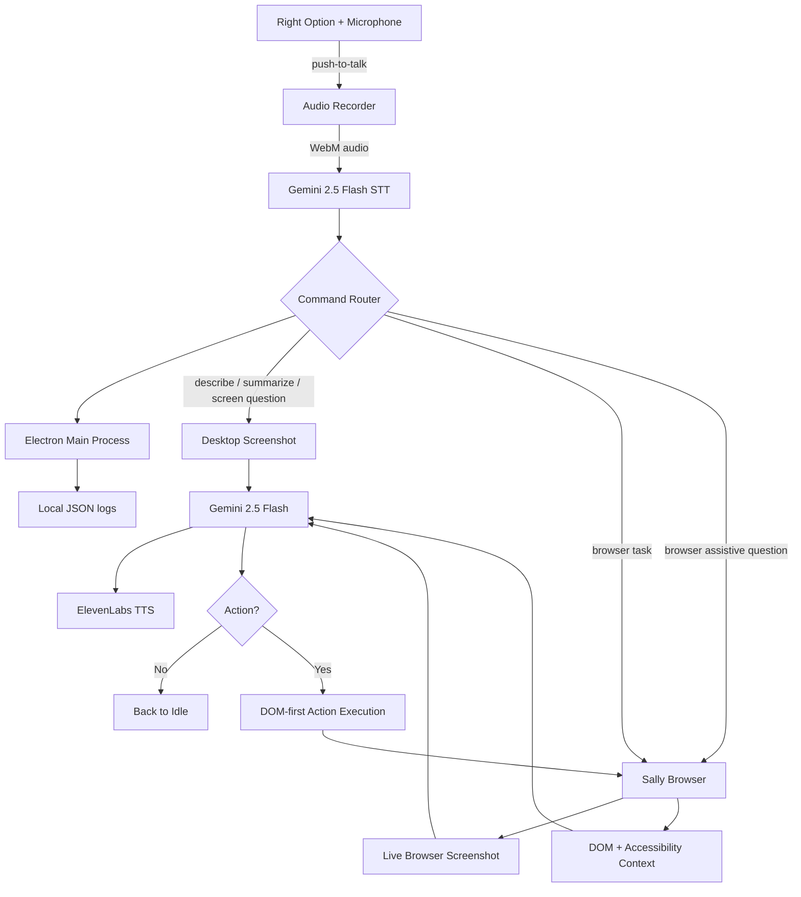
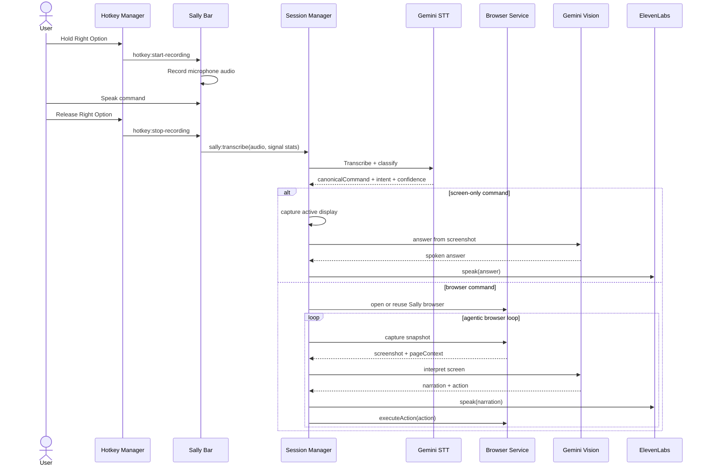

# Sally — Complete System Architecture

> **Gemini Live Agent Challenge 2026 | UI Navigator Track | Accessibility Focus**
>
> *"The AI assistant that sees, understands, and acts, so you don't have to click."*
>
> Sally lets people with motor impairments, RSI, cognitive disabilities, or anyone who wants hands-free web control use websites with just their voice. It combines Gemini's multimodal vision, push-to-talk input, a persistent Electron-owned browser with DOM access, and ElevenLabs neural TTS in a single, continuous control loop.

---

## Table of Contents

1. [The Big Picture — Plain English](#1-the-big-picture--plain-english)
2. [Why Sally Exists — The Problem](#2-why-sally-exists--the-problem)
3. [How Sally Solves It — The Solution Loop](#3-how-sally-solves-it--the-solution-loop)
4. [System Components Overview](#4-system-components-overview)
5. [High-Level Architecture Diagram](#5-high-level-architecture-diagram)
6. [Voice Flow — Step by Step](#6-voice-flow--step-by-step)
7. [Gemini Vision Pipeline](#7-gemini-vision-pipeline)
8. [Direct Gemini API](#8-direct-gemini-api)
9. [Electron App Architecture](#9-electron-app-architecture)
10. [Electron Browser Agentic Loop — DOM + Screenshot Control](#10-electron-browser-agentic-loop--dom--screenshot-control)
11. [IPC Communication Layer](#11-ipc-communication-layer)
12. [Session State Machine](#12-session-state-machine)
13. [Provider System — Gemini-First Architecture](#13-provider-system--gemini-first-architecture)
14. [Data Flow — Every Byte, Every Step](#14-data-flow--every-byte-every-step)
15. [Deployment notes](#15-deployment-notes)
16. [Security Architecture](#16-security-architecture)
17. [Component File Map](#17-component-file-map)
18. [Hackathon Judging Alignment](#18-hackathon-judging-alignment)
19. [Sequence Diagrams — Real Scenarios](#19-sequence-diagrams--real-scenarios)
20. [Error Handling & Fallback Paths](#20-error-handling--fallback-paths)
21. [macOS Integration](#21-macos-integration)

---

## 1. The Big Picture — Plain English

Imagine you have a motor impairment, RSI flare-up, or even a broken wrist. You want to get into Gmail, open compose, read the page, and move through the interface without touching a mouse. Modern websites make that harder than it should be. They hide controls behind menus, dialogs, popovers, sidebars, and tiny buttons that demand precise physical interaction.

**Sally changes that interaction model.**

You press and hold **Right Option** on macOS (labeled **Right Option** in the app; the underlying key is the right Alt / Option key). You say: *"Go to Gmail and click the compose button."* You release the key.

Sally only runs on **macOS 11 (Big Sur) or later**: the main entry point (`electron/main/index.ts`) shows a `dialog.showErrorBox` and exits on Windows and Linux because windowing (vibrancy + screen-saver level), the AppKit application/dock menu, content protection, and Accessibility-based hotkey registration are macOS-only.

Sally then:

1. **Hears you** — records your voice through push-to-talk
2. **Understands you** — transcribes the command using Gemini 2.5 Flash
3. **Routes the task** — decides whether this is a screen question, summary, browser assistive command, or browser action task
4. **Opens or reuses Sally browser** — a persistent Electron-owned browser window with saved cookies and sessions
5. **Looks at the page** — captures the live browser screenshot and extracts DOM/page context
6. **Thinks one step at a time** — sends screenshot + context + instruction to Gemini 2.5 Flash
7. **Speaks back** — ElevenLabs narrates what Sally sees and what it is doing
8. **Acts on the page** — clicks, fills, focuses, types, checks, scrolls, and navigates directly in the live DOM
9. **Loops until done** — captures a fresh screenshot, asks Gemini for the next step, and repeats until the task completes

All of that happens without the user needing to touch the mouse. Sally becomes the user's hands on screen.

---

## 2. Why Sally Exists — The Problem

```text
3.8 million workers suffer RSI annually in the US alone.
1 in 5 people worldwide live with a disability.
Modern websites still assume precise pointer control.
```

The modern web demands repeated physical effort:
- clicking small buttons and links
- typing into exact fields with precise focus
- navigating menus, tabs, accordions, dialogs, and dropdowns
- scrolling through long pages to find the right section
- reacting to validation errors, banners, and state changes

Traditional voice assistants help with simple commands, but they do not reliably understand a full visual web interface, choose the right element, and continue through a task. Meanwhile, fully manual browser automation often opens a fresh session, lands on the wrong page, or loses the user's context.

**Sally exists to bridge that gap.** It is not just a chatbot and not just a browser macro runner. It is a multimodal UI navigator: it sees the interface, understands what is on screen, and executes the next useful action.

---

## 3. How Sally Solves It — The Solution Loop

```text
┌─────────────────────────────────────────────────────────────┐
│                    THE SALLY LOOP                           │
│                                                             │
│  User holds hotkey -> speaks -> releases hotkey            │
│         ↓                                                   │
│  Gemini transcribes audio -> text instruction              │
│         ↓                                                   │
│  Router decides: screen-only or browser task              │
│         ↓                                                   │
│  ┌──► Sally browser captures screenshot + DOM context     │
│  │         ↓                                                │
│  │    Gemini 2.5 Flash -> narration + next action         │
│  │         ↓                                                │
│  │    ElevenLabs speaks narration aloud                    │
│  │         ↓                                                │
│  │    Browser service executes DOM-first action            │
│  │         ↓                                                │
│  └── Verify visible state changed, then loop again         │
│         ↓                                                   │
│  action=null -> task complete, back to idle                │
└─────────────────────────────────────────────────────────────┘
```

The loop is intentionally multimodal:
- **Audio input** via push-to-talk speech
- **Visual input** via screenshot capture
- **Structured grounding** via DOM and accessibility context
- **Audio output** via ElevenLabs narration
- **Physical output** via browser actions in the live page

This is the core idea behind Sally: screenshot understanding plus direct UI control.

---

## 4. System Components Overview

| Component | Technology | Role |
|-----------|-----------|------|
| **Electron Shell** | Electron | Desktop host, windows, IPC, session lifecycle |
| **Hotkey Manager** | `uiohook-napi` | Global push-to-talk hotkey |
| **Audio Recorder** | Web Audio API | Captures mic audio as WebM/Opus |
| **Gemini STT** | Gemini 2.5 Flash | Transcription and command recovery |
| **Screenshot Service** | Electron `desktopCapturer` | Full-screen screenshot capture for desktop questions |
| **Browser Service** | Electron `BrowserWindow` + `webContents` | Persistent Sally browser, screenshots, DOM extraction, DOM-first actions |
| **Page Context Extractor** | Injected DOM scripts | Builds control inventory, headings, landmarks, dialogs, messages |
| **Gemini Service** | `@google/genai` | Multimodal planning and visual question answering (user API key) |
| **Cloud Logger** | `cloudLogger` → `mainLogger` | Local JSON lines only (module name is legacy; no remote logging pipeline) |
| **Session Manager** | TypeScript | Main orchestration and state machine |
| **TTS Service** | ElevenLabs API | Neural text-to-speech narration |
| **Config Window** | React | Settings UI for keys, audio, research toggle |
| **Sally Bar** | React | Floating status pill and mic capture surface |
| **Border Overlay** | React | Active-state blue border plus the full-screen waiting modal |
| **Electron Store** | `electron-store` | Persistent config storage |

---

## 5. High-Level Architecture Diagram



The important change from earlier versions of Sally is the browser ownership model. Instead of starting a separate automation browser for each task, Sally now owns and reuses one persistent Electron browser surface. Gemini is called with the `@google/genai` SDK directly from the Electron main process using the user's API key.

---

## 6. Voice Flow — Step by Step

Every spoken command goes through a structured pipeline.



The STT layer is intentionally conservative:
- silence becomes a no-op
- clipped phrases stay low confidence
- incomplete commands do not launch tasks
- browser navigation phrases get a command-focused retry before final rejection

---

## 7. Gemini Vision Pipeline

### Input

Every Gemini browser-planning call receives:
1. **Screenshot** — base64 PNG of the current live browser page
2. **Instruction** — the user's spoken or typed command
3. **History** — recent actions and narration context
4. **Page URL and title** — current browser location
5. **Structured page context** — interactive controls, headings, landmarks, dialogs, visible messages, active element, and semantic summary
6. **Source mode** — currently `electron_browser`

For screen-only questions, Gemini receives:
1. desktop or browser screenshot
2. the user's visual question
3. optional page context if the question is about a live browser page

### System prompt goals

Gemini is instructed to:
- describe only what matters for the user's goal
- choose one next action at a time
- treat the screenshot as primary truth
- use DOM/page context as grounding for precise targeting
- avoid guessing when the screen is unclear
- set `action` to `null` when the goal is already achieved

### Browser planning JSON schema

```json
{
  "narration": "I can see Gmail with a Compose button on the left.",
  "action": {
    "type": "click",
    "selector": "Compose"
  }
}
```

### Screen-question JSON schema

```json
{
  "answer": "I can see a page showing about ten people with their names underneath.",
  "shouldResearch": false,
  "researchQuery": null
}
```

### Action family

| Type | Fields | Example |
|------|--------|---------|
| `navigate` | `url` | `{"type":"navigate","url":"https://gmail.com"}` |
| `click` | `selector`, `index?` | `{"type":"click","selector":"Compose"}` |
| `fill` | `selector`, `value`, `index?` | `{"type":"fill","selector":"Search","value":"Gemini docs"}` |
| `type` | `value` | `{"type":"type","value":"hello world"}` |
| `select` | `selector`, `value` | `{"type":"select","selector":"Country","value":"United States"}` |
| `press` | `value` | `{"type":"press","value":"Enter"}` |
| `hover` | `selector`, `index?` | `{"type":"hover","selector":"Account menu"}` |
| `focus` | `selector`, `index?` | `{"type":"focus","selector":"Search mail"}` |
| `check` | `selector`, `index?` | `{"type":"check","selector":"Remember me"}` |
| `uncheck` | `selector`, `index?` | `{"type":"uncheck","selector":"Subscribe"}` |
| `scroll` | — | `{"type":"scroll"}` |
| `scroll_up` | — | `{"type":"scroll_up"}` |
| `back` | — | `{"type":"back"}` |
| `wait` | `value?` | `{"type":"wait","value":"1000"}` |

### Special browser-assistive paths

Certain requests bypass the full action loop and answer directly from page context:
- `what can I do here`
- `what buttons are on this page`
- `what form fields are here`
- `what links are here`
- `what headings are here`
- `read the errors`

That keeps common assistive questions fast and deterministic.

---

## 8. Direct Gemini API

All multimodal Gemini calls (`interpretScreen`, screen questions, user-request routing, task planning, email draft, browser rescue) run in **`electron/main/services/geminiService.ts`** via **`GoogleGenAI`** from `@google/genai`, using the Gemini API key stored in Settings (`electron-store`).

Speech-to-text uses the same key against the Generative Language REST API in **`transcriptionService.ts`**.

Structured responses use JSON mode from the model; invalid JSON or missing required fields surface as errors to the session layer rather than silent canned fallbacks.

---

## 9. Electron App Architecture

### Process model

```text
┌─────────────────────────────────────────────┐
│                MAIN PROCESS                 │
│                                             │
│  index.ts          - app lifecycle          │
│  windowManager.ts  - window creation/mgmt   │
│  hotkeyManager.ts  - global keyboard hook   │
│  ipcHandlers.ts    - IPC channel registry   │
│                                             │
│  managers/                                  │
│    sessionManager.ts  - orchestration brain │
│    apiKeyManager.ts   - config + key state  │
│    microphoneManager.ts - mic mute state    │
│    macPermissionsManager.ts - Accessibility │
│                                             │
│  services/                                  │
│    browserService.ts    - Sally browser     │
│    browserDomRuntime.ts - injected DOM side │
│    geminiService.ts     - Gemini calls      │
│    geminiNormalizers.ts - response shaping   │
│    transcriptionService.ts - STT + recovery │
│    ttsService.ts        - ElevenLabs TTS    │
│    screenshotService.ts - desktop capture   │
│    pageContext.ts       - DOM extraction    │
│    cloudLogger.ts       - local JSON logs   │
│    destinationResolver.ts - URL hints      │
│                                             │
│  utils/                                     │
│    constants.ts  - AGENT_LOOP + defaults    │
│    store.ts / storeRepair.ts - persistence  │
└─────────────────────────────────────────────┘
         │ IPC (invoke / broadcast)
         ▼
┌─────────────────────────────────────────────┐
│            RENDERER PROCESSES               │
│                                             │
│  Config Window  - Settings UI               │
│  Sally Bar      - Floating status pill      │
│  Border Overlay - Active-state indicator    │
└─────────────────────────────────────────────┘
```

### Main process responsibilities

The main process owns:
- the browser lifecycle
- the session state machine
- Gemini planning calls
- TTS dispatch
- hotkey handling
- IPC request/response boundaries

### Renderer responsibilities

Renderer windows stay thin:
- collect microphone audio
- render settings and state
- play back TTS audio
- surface live feedback and previews

During `awaiting_response`, the overlay renderer also owns the full-screen wait treatment: the browser blurs and dims, a centered message reads `Agent is waiting for your reply`, and an `End Agent` button cancels the whole task back to idle.

That split keeps the sensitive automation and API orchestration logic in the main process.

---

## 10. Electron Browser Agentic Loop — DOM + Screenshot Control

### Runtime model

Sally no longer relies on a separately launched Playwright browser as the primary task path.

Instead, `browserService` owns a persistent Electron browser window:
- one Sally browser is reused across tasks
- its session partition persists cookies and local storage
- the same browser can stay logged in across app restarts
- the initial visible page is a useful destination, not a dead blank startup tab

### Why this model is stronger

This browser model removes several problems that appeared in the older approach:
- inconsistent profile locking
- fresh-session behavior on repeated tasks
- unreliable reuse of an external browser
- `about:blank` startup friction

### Loop structure

```text
1. Receive canonical browser instruction
2. Resolve a starting destination when possible
3. Open or reuse Sally browser
4. Capture browser screenshot + page context
5. Ask Gemini for narration + one next action
6. Speak narration
7. Execute action in the live DOM
8. Verify the page changed or settled
9. Repeat until action=null, user cancel, **`AGENT_LOOP.maxIterations` (40)** steps, **`AGENT_LOOP.maxDurationMs` (10 min)**, or **`sessionManager`** bailout narration
```

### DOM-first action strategy

For actions like `click`, `fill`, `focus`, `check`, and `select`, Sally tries to target the page semantically:

1. role and accessible name
2. label or placeholder
3. visible text match
4. ordinal targeting with `index`
5. focused-element keyboard fallback when appropriate

This is what enables commands like:
- `click the compose button`
- `focus the search box`
- `click the second result`
- `check remember me`

### Browser assistive layer

The browser loop is not the only browser path. Sally also has fast direct-response helpers for:
- `what can I do here`
- `what buttons are on this page`
- `what form fields are here`
- `what links are here`
- `what headings are here`
- `read the errors`

Those commands use the current browser snapshot without asking Gemini to plan a generic action loop first.

---

## 11. IPC Communication Layer

Canonical channel signatures live in **`shared/types.ts`** (`IpcChannels`). Handlers are registered in **`electron/main/ipcHandlers.ts`** (preload exposes a typed bridge only; it does not whitelist channels individually).

### Invokable channels (renderer → main)

#### Config & keys

| Channel | Purpose |
|---------|---------|
| `sally:get-config` | Full settings snapshot shown in the UI |
| `sally:get-provider` / `sally:set-provider` | Provider enum (Gemini-only today) |
| `sally:set-api-key` / `sally:test-api-key` / `sally:clear-api-key` | Legacy combined provider key path |
| `sally:set-gemini-key` / `sally:get-gemini-key-status` | Gemini API key |
| `sally:set-elevenlabs-key` / `sally:get-elevenlabs-key-status` | ElevenLabs API key |
| `sally:set-auto-research-screen-questions` / `sally:get-auto-research-screen-questions` | Screen-question research toggle |

#### Audio & voice session

| Channel | Purpose |
|---------|---------|
| `sally:get-audio-device` / `sally:set-audio-device` | Preferred microphone |
| `sally:get-mic-muted` / `sally:set-mic-muted` | Push-to-talk mute gate |
| `sally:preview-transcription` | Live subtitle / preview transcription |
| `sally:transcribe` | Final STT plus full session routing |
| `sally:handle-silence` | Silence / confirmation-listen gestures |
| `sally:send-instruction` | Composer / typed command entry |
| `sally:cancel` | Hard-cancel current run |

#### Sally browser shell (devtools-style controls used by embedded UI)

| Channel | Purpose |
|---------|---------|
| `browser:get-state` | Tabs + loading flags |
| `browser:new-tab` / `browser:switch-tab` / `browser:close-tab` | Tab strip operations |
| `browser:navigate` / `browser:go-back` / `browser:go-forward` / `browser:reload` | Navigation |
| `browser:get-snapshot` | Lightweight DOM/count snapshot for debugging |
| `browser:execute-action` | Executes a structured `BrowserActionRequest` |
| `browser:inspect-gmail-draft` | Gmail compose inspection helper |

#### Shell windows

| Channel | Purpose |
|---------|---------|
| `window:show-config` | Focus settings |
| `window:show-browser` | Ensure Sally browser is launched |
| `window:set-pill-layout` / `window:hide-pill` / `window:show-pill` | Sally Bar geometry & visibility |

#### Other

| Channel | Purpose |
|---------|---------|
| `sally:open-external` | `shell.openExternal` for safe links |

#### Renderer → main (implicit, not `ipcMain.handle`)

Playback completion uses **`ipcMain.on`** from the Sally Bar: **`sally:tts-playback-complete`** and **`sally:tts-playback-error`** (see `ttsService.ts`).

### Broadcast channels (main → renderer)

| Channel | Purpose |
|---------|---------|
| `sally:state-changed` | `{ state, text? }` driving the pill |
| `sally:step` | Structured automation breadcrumbs |
| `sally:chat` | Chat / transcript lines |
| `sally:overlay-highlight` / `sally:overlay-clear` | Border, target rects, waiting banner |
| `sally:auto-confirmation-listen` / `sally:auto-confirmation-stop` | Risky-action confirmation mic window |
| `sally:tts-audio` | Base64 audio buffer `{ audioBase64, id }` |
| `sally:tts-stop` | Stop current audio |
| `sally:mic-muted-changed` | Mic LED state |
| `browser:state-changed` | Mirrors `browser:get-state` for live tab UI |
| `hotkey:start-recording` / `hotkey:stop-recording` / `hotkey:cancel-recording` | Push-to-talk bridge |

IPC stays the trust boundary: renderer captures audio and paints UI; **`sessionManager`** owns routing, Gemini calls, and browser automation.

---

