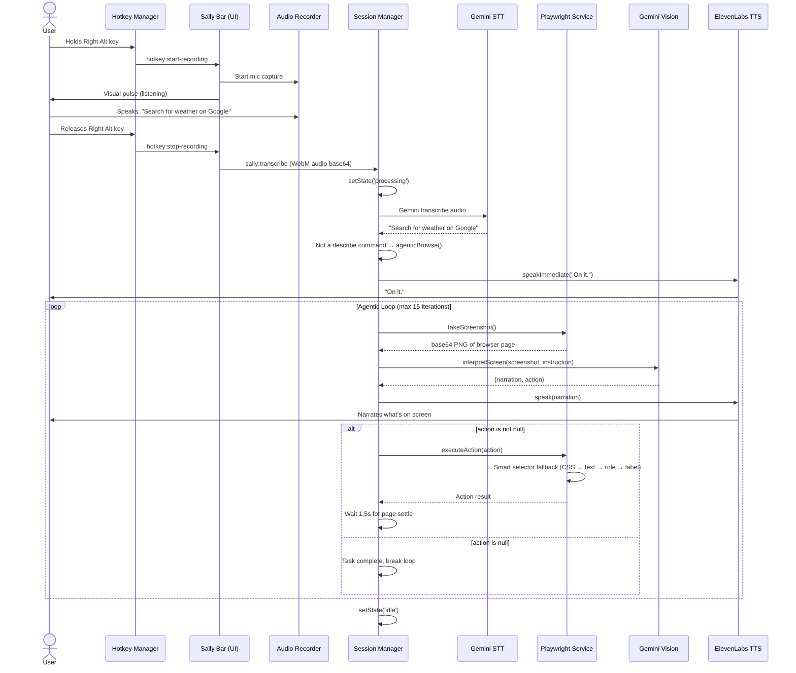
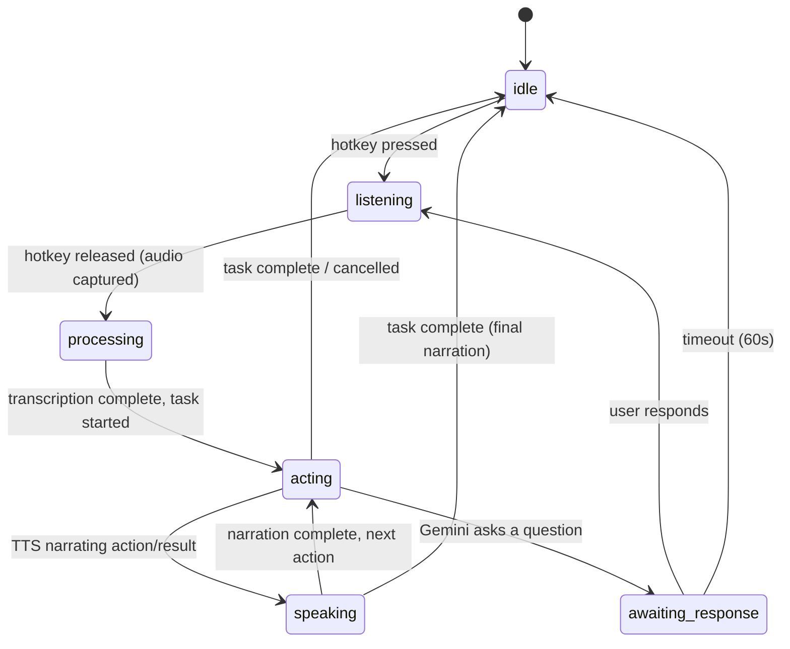
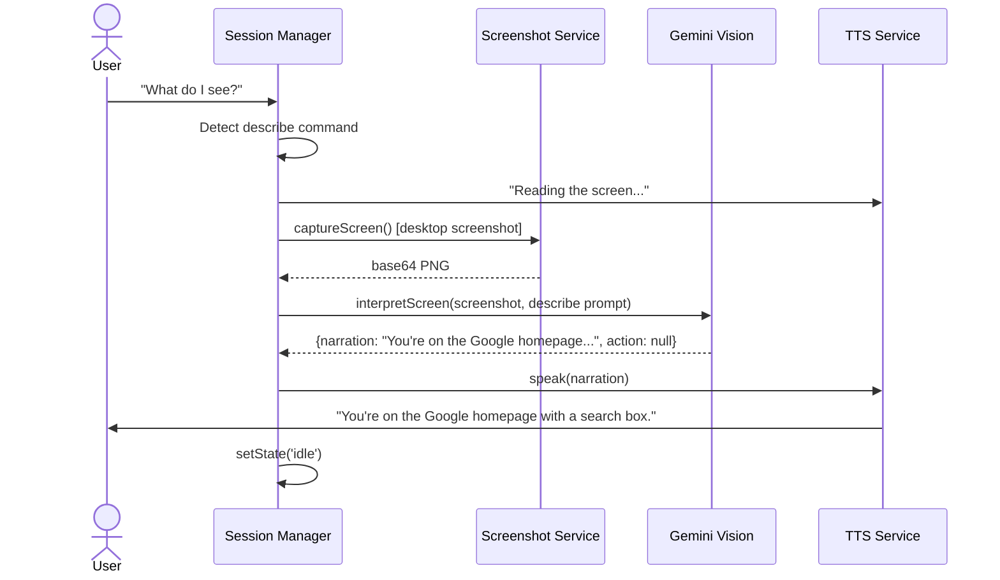
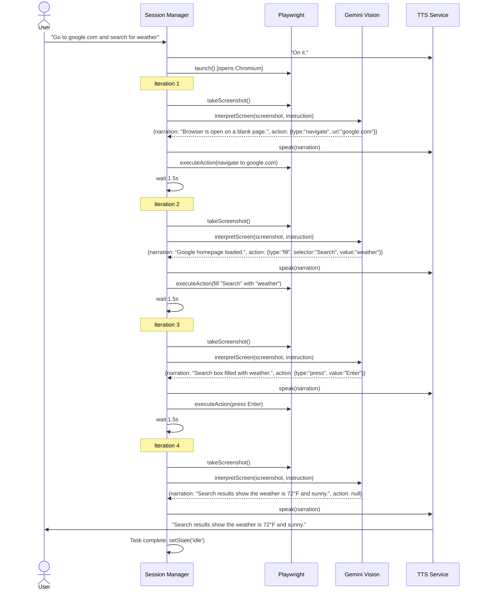
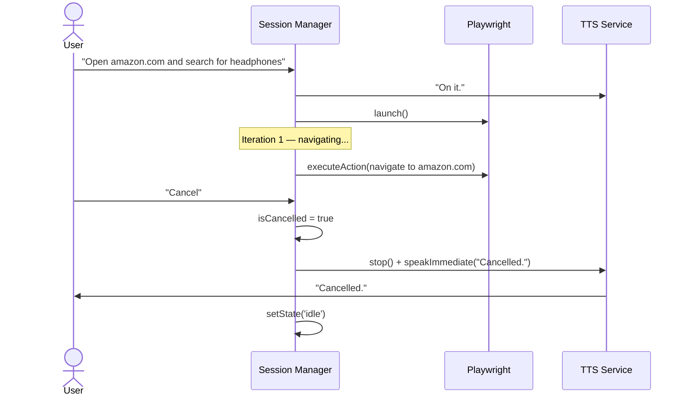
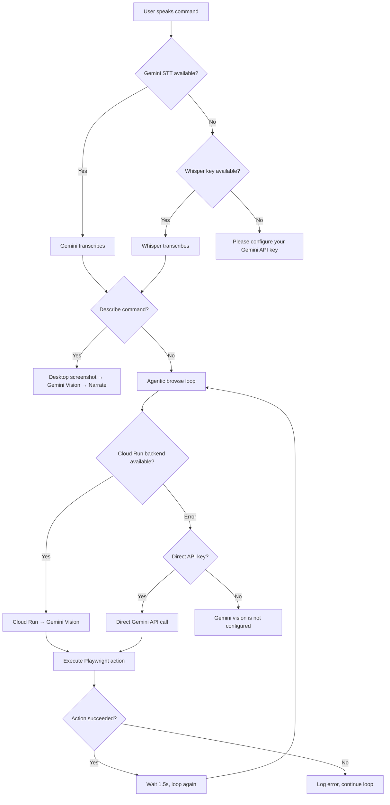

# Sally — Complete System Architecture

> **Gemini Live Agent Challenge 2026 | UI Navigator Track | Accessibility Focus**
>
> *"The AI assistant that sees, understands, and acts — so you don't have to click."*
>
> Sally lets people with motor impairments, RSI, cognitive disabilities, or anyone who wants hands-free web control use any website with just their voice. It combines Gemini's multimodal vision, push-to-talk input, direct Playwright browser automation in an agentic loop, and ElevenLabs neural TTS — all in a seamless, real-time loop.

---

## Table of Contents

1. [The Big Picture — Plain English](#1-the-big-picture--plain-english)
2. [Why Sally Exists — The Problem](#2-why-sally-exists--the-problem)
3. [How Sally Solves It — The Solution Loop](#3-how-sally-solves-it--the-solution-loop)
4. [System Components Overview](#4-system-components-overview)
5. [High-Level Architecture Diagram](#5-high-level-architecture-diagram)
6. [Voice Flow — Step by Step](#6-voice-flow--step-by-step)
7. [Gemini Vision Pipeline](#7-gemini-vision-pipeline)
8. [Cloud Run Backend — Deep Dive](#8-cloud-run-backend--deep-dive)
9. [Electron App Architecture](#9-electron-app-architecture)
10. [Playwright Agentic Loop — Browser Automation](#10-playwright-agentic-loop--browser-automation)
11. [IPC Communication Layer](#11-ipc-communication-layer)
12. [Session State Machine](#12-session-state-machine)
13. [Provider System — Multi-LLM Architecture](#13-provider-system--multi-llm-architecture)
14. [Data Flow — Every Byte, Every Step](#14-data-flow--every-byte-every-step)
15. [Google Cloud Deployment](#15-google-cloud-deployment)
16. [Security Architecture](#16-security-architecture)
17. [Component File Map](#17-component-file-map)
18. [Hackathon Judging Alignment](#18-hackathon-judging-alignment)
19. [Sequence Diagrams — Real Scenarios](#19-sequence-diagrams--real-scenarios)
20. [Error Handling & Fallback Paths](#20-error-handling--fallback-paths)

---

## 1. The Big Picture — Plain English

Imagine you have a motor impairment — or even just a broken wrist. You want to book a flight on Google Flights. Normally you'd need to click through dozens of dropdowns, type into form fields, scroll through results, and click tiny buttons. Each precise mouse movement is painful, exhausting, or impossible.

**Sally changes this completely.**

You press and hold the Right Alt key on your keyboard (Right Option on macOS) — a physical button, no mouse or screen needed. You say: *"Book a flight from London to New York next Friday, cheapest option."* You release the key.

Sally then:

1. **Hears you** — Records your voice via the microphone (no typing required)
2. **Understands you** — Transcribes speech to text using Gemini 2.5 Flash
3. **Opens a browser** — Launches Chrome via Playwright (using your logged-in profile)
4. **Takes a screenshot** — Captures the browser page
5. **Thinks about what it sees** — Sends the screenshot + your instruction to Gemini 2.5 Flash
6. **Speaks back to you** — ElevenLabs reads Gemini's narration aloud: *"I can see Google Flights. I'll start filling in the form."*
7. **Acts on the browser** — Playwright clicks fields, types dates, submits the form
8. **Loops** — Takes another screenshot, asks Gemini what's next, executes, narrates — until the task is done
9. **Reports the result** — *"I found 3 flights. The cheapest is 287 dollars on March 14th."*

All of this happens with your hands never touching a mouse or touchscreen. Sally is the interface.

---

## 2. Why Sally Exists — The Problem

```
3.8 million workers suffer RSI annually in the US alone.
1 in 5 people worldwide live with a disability.
15% of the global population has some form of motor impairment.
```

The modern web demands **precise, repetitive physical actions**:
- Clicking small buttons, links, and checkboxes
- Typing into forms with exact formatting
- Scrolling through long pages to find content
- Dragging sliders, selecting dropdowns, navigating menus

For people with motor impairments (ALS, cerebral palsy, arthritis, RSI, temporary injuries), each of these actions is a barrier. Voice assistants like Siri and Alexa help with simple tasks, but they can't navigate a web page, fill out a form, or click a specific button on screen.

**Sally bridges this gap.** It looks at the screen with Gemini's multimodal vision, understands what it sees, and acts on it — all driven by voice. No mouse, no keyboard, no physical strain.

---

## 3. How Sally Solves It — The Solution Loop

```
┌─────────────────────────────────────────────────────────────┐
│                    THE SALLY LOOP                           │
│                                                             │
│  User holds hotkey → speaks → releases hotkey              │
│         ↓                                                   │
│  Gemini transcribes audio → text instruction               │
│         ↓                                                   │
│  ┌──► Playwright takes browser screenshot                  │
│  │         ↓                                                │
│  │    Gemini 2.5 Flash → narration + next action           │
│  │         ↓                                                │
│  │    ElevenLabs speaks narration aloud                     │
│  │         ↓                                                │
│  │    Playwright executes action (click/fill/navigate)      │
│  │         ↓                                                │
│  └── Wait 1.5s for page to settle, loop again              │
│         ↓                                                   │
│  action=null → task complete, back to idle                  │
└─────────────────────────────────────────────────────────────┘
```

The loop is **multimodal** — it combines:
- **Audio input** (voice command)
- **Visual input** (screenshot)
- **Audio output** (TTS narration)
- **Physical output** (browser automation)

This is exactly what the **Gemini Live Agent Challenge UI Navigator Track** calls for: *"agents that interpret browser/device displays and perform actions based on user intent."*

---

## 4. System Components Overview

| Component | Technology | Role |
|-----------|-----------|------|
| **Electron Shell** | Electron v33 | Desktop app host, window management, IPC bus |
| **Hotkey Manager** | uiohook-napi | Global keyboard hook (Right Alt key) |
| **Audio Recorder** | Web Audio API | Captures mic input as WebM/Opus |
| **Gemini STT** | Gemini 2.5 Flash | Speech-to-text transcription |
| **Screenshot Service** | Electron desktopCapturer | Captures full screen as base64 PNG |
| **Playwright Service** | playwright-core | Launches and controls Chromium browser directly |
| **Gemini Service** | @google/genai SDK + HTTP | Calls Gemini 2.5 Flash for vision (direct or via Cloud Run) |
| **Cloud Run Backend** | Node.js + Express | Gemini 2.5 Flash proxy, deployed on GCP |
| **Session Manager** | TypeScript | Orchestrates the agentic browse loop |
| **TTS Service** | ElevenLabs API | Neural text-to-speech narration |
| **Config Window** | React | Settings UI (provider, keys, backend URL) |
| **Sally Bar** | React | Pill-shaped status overlay (visible on screen) |
| **Border Overlay** | React | Full-screen blue border when Sally is active |
| **Electron Store** | electron-store | Persistent key-value storage for config |

---

## 5. High-Level Architecture Diagram

```mermaid
graph TD
    A[Right Alt + Microphone] -->|push-to-talk| B[Audio Recorder]
    B -->|WebM audio| C[Gemini 2.5 Flash STT]
    C --> D{Command Router}

    D -->|describe| E[Desktop Screenshot]
    D -->|action| SHOT
    D -->|smart home| EXPAND[Expand Command] --> SHOT

    E --> GEMINI[Gemini 2.5 Flash Vision]
    SHOT[Screenshot Browser Page] --> GEMINI

    GEMINI --> TTS[ElevenLabs TTS → Speaker]
    GEMINI --> CHECK{Action?}
    CHECK -->|No — task done| IDLE[Back to Idle]
    CHECK -->|Yes| EXEC[Playwright: Execute Action]
    EXEC --> BROWSER[Chrome / Edge]
    BROWSER -->|wait 1.5s| SHOT

    GEMINI -.->|Cloud Run backend| CR[Google Cloud Run]
    GEMINI -.->|direct fallback| SDK[@google/genai SDK]
```

---

## 6. Voice Flow — Step by Step

This is the core interaction loop. Every spoken command goes through this exact path.



---

## 7. Gemini Vision Pipeline

### Input

Every Gemini Vision call receives:
1. **Screenshot** — Base64 PNG of the current browser page (from Playwright)
2. **Instruction** — The user's voice command (or ongoing task context)

### System Prompt

```
You are Sally, a voice-first accessibility agent that helps people with motor impairments, disabilities, or anyone who wants hands-free web control.
You work in an agentic loop: you receive a screenshot of a browser page and a user
instruction, and you return ONE next step at a time.

Your job:
1. Briefly describe what you see that's relevant to the user's goal
2. Decide the single best NEXT action to make progress toward the goal
3. If the goal is already achieved or no action is needed, set action to null

Action types: navigate, click, fill, type, select, press, hover, scroll, scroll_up, back, wait, or null
```

### JSON Output Schema

```json
{
  "narration": "I see the Google homepage with a search box in the center.",
  "action": {
    "type": "fill",
    "selector": "Search",
    "value": "weather forecast"
  }
}
```

### Action Types

| Type | Fields | Example |
|------|--------|---------|
| `navigate` | `url` | `{"type":"navigate","url":"https://google.com"}` |
| `click` | `selector` | `{"type":"click","selector":"Search Google"}` |
| `fill` | `selector`, `value` | `{"type":"fill","selector":"Search","value":"weather"}` |
| `type` | `value` | `{"type":"type","value":"hello world"}` |
| `select` | `selector`, `value` | `{"type":"select","selector":"#country","value":"US"}` |
| `press` | `value` | `{"type":"press","value":"Enter"}` |
| `hover` | `selector` | `{"type":"hover","selector":"Menu"}` |
| `scroll` | (none) | `{"type":"scroll"}` |
| `scroll_up` | (none) | `{"type":"scroll_up"}` |
| `back` | (none) | `{"type":"back"}` |
| `wait` | `value` (ms) | `{"type":"wait","value":"2000"}` |
| `null` | — | Task complete |

### Describe Commands

When the user says "what do I see?" or similar, Sally skips the agentic loop and does a single Gemini Vision call using a desktop screenshot (via Electron desktopCapturer) with a descriptive prompt. This returns narration only, no action.

### Dual Backend: Cloud Run + Direct API

```
interpretScreen()
    ├── Try Cloud Run backend (if URL configured)
    │       POST /api/interpret-screen
    │       └── Falls back on error (5-min cooldown)
    └── Try direct Gemini API (if API key available)
            @google/genai SDK → generateContent()
```

---

## 8. Cloud Run Backend — Deep Dive

### Service Configuration

| Setting | Value |
|---------|-------|
| **Region** | us-central1 |
| **CPU** | 1 vCPU |
| **Memory** | 512 MiB |
| **Min instances** | 0 (scale to zero) |
| **Max instances** | 10 |
| **Timeout** | 60s |
| **Auth** | Allow unauthenticated |
| **Concurrency** | 80 |

### API Contract

**Endpoint:** `POST /api/interpret-screen`

**Request:**
```json
{
  "screenshot": "<base64-encoded-PNG>",
  "instruction": "Search for weather on Google"
}
```

**Response:**
```json
{
  "narration": "I see the Google homepage with a search box.",
  "action": {
    "type": "fill",
    "selector": "[aria-label='Search']",
    "value": "weather"
  }
}
```

**Health Check:** `GET /health` → `{ "status": "ok" }`

### Technology

- **Runtime:** Node.js 22 on Cloud Run
- **Framework:** Express.js
- **AI SDK:** `@google/genai` (official Google Gen AI SDK)
- **Model:** Gemini 2.5 Flash (multimodal)

---

## 9. Electron App Architecture

### Process Model

```
┌─────────────────────────────────────────────┐
│                MAIN PROCESS                  │
│                                              │
│  index.ts          — App lifecycle           │
│  windowManager.ts  — Window creation/mgmt    │
│  hotkeyManager.ts  — Global keyboard hook    │
│  ipcHandlers.ts    — IPC channel registry    │
│                                              │
│  managers/                                   │
│    sessionManager.ts  — Agentic browse loop  │
│    apiKeyManager.ts   — BYOK key storage     │
│    microphoneManager.ts — Mic mute state     │
│                                              │
│  services/                                   │
│    playwrightService.ts — Browser automation  │
│    geminiService.ts     — Gemini Vision API   │
│    whisperService.ts    — STT (Gemini/Whisper)│
│    ttsService.ts        — ElevenLabs TTS      │
│    screenshotService.ts — Desktop capture      │
│                                                 │
│                                              │
│  utils/                                      │
│    constants.ts  — Config constants           │
│    store.ts      — Electron Store wrapper     │
└─────────────────────────────────────────────┘
         │ IPC (invoke / broadcast)
         ▼
┌─────────────────────────────────────────────┐
│           RENDERER PROCESSES                 │
│                                              │
│  Config Window  — Settings UI                │
│  Sally Bar      — Floating status pill       │
│  Border Overlay — Active state indicator     │
└─────────────────────────────────────────────┘
```

### Key Services

**SessionManager** — The brain. Orchestrates the entire flow:
- Receives transcribed voice commands
- Routes describe commands to single Gemini Vision call
- Routes action commands to `agenticBrowse()` loop
- Manages state transitions (idle → processing → acting → speaking → idle)
- Handles cancellation via `isCancelled` flag

**PlaywrightService** — Direct browser control:
- Launches Chromium using system Edge or Chrome (auto-discovery)
- `takeScreenshot()` — Returns base64 PNG of the browser page
- `executeAction()` — Dispatches all 11 action types (navigate, click, fill, type, select, press, hover, scroll, scroll_up, back, wait)
- Smart selector fallbacks: CSS → visible text → ARIA role → label → placeholder
- Persistent browser: stays open between commands, closes on app quit

**GeminiService** — Vision intelligence:
- Dual-path: Cloud Run backend (preferred) → direct API (fallback)
- Returns structured JSON: `{ narration, action }`
- System prompt tuned for agentic loop (one action at a time)

**TTSService** — Voice output:
- ElevenLabs neural TTS for natural speech
- Queue-based: multiple sentences queued and played in order
- `speakImmediate()` — Interrupts queue for urgent messages

---

## 10. Playwright Agentic Loop — Browser Automation

### Architecture

Unlike traditional browser automation that relies on a gateway/proxy, Sally drives Playwright directly from the Electron main process. This eliminates the need for sidecar processes, WebSocket connections, authentication tokens, or Chrome extensions.

```
┌─────────────────────────────────────────────┐
│            SESSION MANAGER                   │
│                                              │
│  agenticBrowse(instruction)                  │
│    │                                         │
│    ├─► playwrightService.launch()            │
│    │     └─► chromium.launch({               │
│    │           executablePath: Edge/Chrome    │
│    │         })                              │
│    │                                         │
│    └─► LOOP (max 15 iterations, 3 min)       │
│          │                                   │
│          ├─ playwrightService.takeScreenshot()│
│          ├─ geminiService.interpretScreen()   │
│          ├─ ttsService.speak(narration)       │
│          ├─ playwrightService.executeAction() │
│          └─ wait 1.5s for page settle        │
│                                              │
│  Cancel: isCancelled flag checked each iter  │
└─────────────────────────────────────────────┘
```

### Browser Discovery

On Windows, Sally auto-discovers an installed browser in this order:
1. Microsoft Edge (`C:\Program Files (x86)\Microsoft\Edge\Application\msedge.exe`)
2. Google Chrome (`C:\Program Files\Google\Chrome\Application\chrome.exe`)
3. Chrome Canary (via `LOCALAPPDATA`)
4. Bundled Chromium (fallback if none found)

### Smart Selector Strategy

When Gemini returns a selector (e.g., "Search" or "Submit"), Playwright tries multiple strategies:

```
1. CSS selector     page.click(selector)
2. Visible text     page.getByText(selector)
3. ARIA role        page.getByRole('button', {name: selector})
4. Label            page.getByLabel(selector)
5. Placeholder      page.getByPlaceholder(selector)
```

Each strategy has a 2-3 second timeout before falling to the next. This makes Sally robust against selectors that don't exactly match the DOM.

### Supported Actions

| Action | Method | Timeout |
|--------|--------|---------|
| `navigate` | `page.goto(url)` | 10s |
| `click` | Smart fallback chain | 2-3s per strategy |
| `fill` | Smart fallback chain | 2-3s per strategy |
| `type` | `page.keyboard.type()` | instant |
| `select` | `page.selectOption()` | 10s |
| `press` | `page.keyboard.press()` | instant |
| `hover` | Smart fallback chain | 2-3s per strategy |
| `scroll` | `page.mouse.wheel(0, 400)` | instant |
| `scroll_up` | `page.mouse.wheel(0, -400)` | instant |
| `back` | `page.goBack()` | 10s |
| `wait` | `page.waitForTimeout()` | up to 5s |

---

## 11. IPC Communication Layer

### Invokeable Channels (Renderer → Main)

| Channel | Purpose |
|---------|---------|
| `sally:get-config` | Get current config state |
| `sally:set-provider` | Switch AI provider |
| `sally:set-api-key` | Save API key for provider |
| `sally:test-api-key` | Validate API key |
| `sally:clear-api-key` | Remove stored API key |
| `sally:set-elevenlabs-key` | Save ElevenLabs TTS key |
| `sally:set-whisper-key` | Save Whisper STT key |
| `sally:set-gemini-key` | Save Gemini API key |
| `sally:set-gemini-backend-url` | Save Cloud Run backend URL |
| `sally:get-gemini-backend-url` | Get Cloud Run backend URL |
| `sally:get-provider` | Get current AI provider |
| `sally:get-elevenlabs-key-status` | Check if ElevenLabs key is stored |
| `sally:get-whisper-key-status` | Check if Whisper key is stored |
| `sally:get-gemini-key-status` | Check if Gemini key is stored |
| `sally:get-audio-device` | Get selected audio input device |
| `sally:set-audio-device` | Set audio input device |
| `sally:get-mic-muted` | Get microphone mute state |
| `sally:set-mic-muted` | Set microphone mute state |
| `sally:transcribe` | Send audio for STT + task execution |
| `sally:preview-transcription` | Live preview of speech |
| `sally:send-instruction` | Send text instruction directly |
| `sally:cancel` | Cancel current task |
| `sally:open-external` | Open URL in default browser |
| `window:show-config` | Show settings window |
| `window:set-pill-layout` | Resize sally bar |

### Broadcast Channels (Main → Renderer)

| Channel | Payload | Purpose |
|---------|---------|---------|
| `sally:state-changed` | `{ state }` | State machine transitions |
| `sally:step` | `{ action, details, timestamp }` | Automation step feedback |
| `sally:chat` | `{ role, text }` | Chat messages for UI |
| `sally:tts-audio` | `{ audioBase64 }` | TTS audio for playback |
| `sally:mic-muted-changed` | `{ muted }` | Microphone mute state |
| `hotkey:start-recording` | — | Push-to-talk key down |
| `hotkey:stop-recording` | — | Push-to-talk key up |
| `hotkey:cancel-recording` | — | Recording cancelled |
| `window:hide-pill` | — | Hide the Sally Bar |
| `window:show-pill` | — | Show the Sally Bar |

---

## 12. Session State Machine



### State → UI Mapping

| State | Sally Bar | Border Overlay | TTS |
|-------|-----------|---------------|-----|
| `idle` | Hidden | Hidden | — |
| `listening` | Visible (pulse) | Blue border | — |
| `processing` | Visible | Blue border | — |
| `acting` | Visible | Blue border | — |
| `speaking` | Visible | Blue border | Narrating actions |
| `awaiting_response` | Visible | Hidden | Waiting for user |

---

## 13. Provider System — Multi-LLM Architecture

Sally supports multiple AI providers for flexibility:

| Provider | STT | Vision | Browser Actions |
|----------|-----|--------|-----------------|
| **Gemini** (default) | Gemini 2.5 Flash | Gemini 2.5 Flash | Playwright (via Gemini agentic loop) |
| **Anthropic** | Whisper | — | — |
| **OpenAI** | Whisper | — | — |

When using Gemini (recommended), all AI capabilities use a single API key:
- Speech-to-text transcription
- Screenshot interpretation (vision)
- Action planning for the agentic loop

---

## 14. Data Flow — Every Byte, Every Step

### Audio Flow
```
Microphone → Web Audio API → WebM/Opus blob → base64 string
    → Gemini STT (or Whisper) → text transcript
```

### Agentic Loop Data Flow
```
Playwright page → screenshot (PNG buffer → base64)
    → Gemini Vision (screenshot + instruction)
    → JSON { narration, action }
    → TTS speaks narration
    → Playwright executes action
    → Wait 1.5s → repeat
```

### TTS Flow
```
Narration text → ElevenLabs API (HTTPS POST)
    → MP3 audio stream → base64 string
    → IPC broadcast → renderer Web Audio playback
    → Speaker output
```

---

## 15. Google Cloud Deployment

### Infrastructure

```
┌─────────────────────────────────────┐
│         Google Cloud Project         │
│                                      │
│  ┌────────────────────────────────┐  │
│  │   Cloud Run: sally-backend     │  │
│  │   - Node.js 22                 │  │
│  │   - @google/genai SDK          │  │
│  │   - Gemini 2.5 Flash           │  │
│  │   - Auto-scaling 0-10          │  │
│  └────────────────────────────────┘  │
│                                      │
│  ┌────────────────────────────────┐  │
│  │   Artifact Registry             │  │
│  │   - Docker images               │  │
│  └────────────────────────────────┘  │
│                                      │
│  ┌────────────────────────────────┐  │
│  │   Cloud Build                   │  │
│  │   - Triggered by gcloud deploy  │  │
│  └────────────────────────────────┘  │
└─────────────────────────────────────┘
```

### Cost Model

| Resource | Cost | Notes |
|----------|------|-------|
| Cloud Run | ~$0/month | Scale-to-zero, pay per request |
| Gemini API | Pay per token | ~$0.001 per vision call |
| ElevenLabs | Pay per character | ~$0.30 per 1000 chars |

---

## 16. Security Architecture

### API Key Storage

All API keys are stored locally using `electron-store`:
- Keys are stored in the user's app data directory
- Never transmitted to any server other than their respective API endpoints
- Can be cleared from the Settings UI

### Screenshot Privacy

- Screenshots are captured locally and sent only to Gemini (via Cloud Run or direct API)
- The Cloud Run backend does not store screenshots — they are processed and discarded
- Users control when screenshots are taken (only during active commands)

### Browser Session

- Playwright uses `launchPersistentContext` with the user's actual Chrome (or Edge) profile directory, so all cookies, saved passwords, and logged-in sessions are preserved
- This means the user does not need to re-authenticate on any site — Sally operates in the same browser context they normally use
- The browser is launched as a separate process; it does not attach to any running Chrome window (Chrome must be closed before Sally can launch)

---

## 17. Component File Map

```
electron/
├── main/
│   ├── index.ts                    # App entry point, lifecycle
│   ├── windowManager.ts            # Window creation and management
│   ├── hotkeyManager.ts            # Global push-to-talk hotkey
│   ├── ipcHandlers.ts              # IPC channel registry
│   ├── managers/
│   │   ├── sessionManager.ts       # Agentic browse loop orchestrator
│   │   ├── apiKeyManager.ts        # BYOK API key storage
│   │   └── microphoneManager.ts    # Microphone mute state
│   ├── services/
│   │   ├── playwrightService.ts    # Browser automation (Playwright)
│   │   ├── geminiService.ts        # Gemini Vision API (Cloud Run + direct)
│   │   ├── whisperService.ts       # Speech-to-text (Gemini/Whisper)
│   │   ├── ttsService.ts           # ElevenLabs text-to-speech
│   │   └── screenshotService.ts    # Desktop screenshot capture
│   └── utils/
│       ├── constants.ts            # Config constants
│       └── store.ts                # Electron Store wrapper
├── preload/
│   └── index.ts                    # Context bridge for renderer
src/
├── windows/
│   ├── config/ConfigWindow.tsx     # Settings UI
│   ├── sallyBar/SallyBarWindow.tsx # Floating status pill
│   └── borderOverlay/BorderOverlay.tsx
shared/
└── types.ts                        # Shared TypeScript types
sally-backend/
├── index.js                        # Cloud Run Express server
├── Dockerfile                      # Container config
└── deploy.sh                       # Deployment script
```

---

## 18. Hackathon Judging Alignment

### Gemini API Usage (25%)

- **Gemini 2.5 Flash** for multimodal vision (screenshot → narration + action)
- **Gemini 2.5 Flash** for speech-to-text transcription
- **@google/genai SDK** used throughout (official Google SDK)
- **Agentic loop** — Gemini drives every step of browser automation
- **Structured JSON output** — `responseMimeType: 'application/json'` for reliable action parsing

### Google Cloud Usage (25%)

- **Cloud Run** — Serverless backend for Gemini vision proxy
- **Cloud Build + Artifact Registry** — CI/CD pipeline
- **Scale-to-zero** — Cost-efficient, production-ready

### Impact & Usefulness (25%)

- Solves a real problem for millions with motor impairments, RSI, cognitive disabilities, and elderly users
- Goes beyond keyboard/mouse — voice replaces all physical interaction
- Handles modern JS-heavy websites that break traditional accessibility tools
- Voice-first: no mouse, no keyboard shortcuts needed

### Creativity & Innovation (25%)

- **Agentic loop** — Not just one-shot vision, but iterative screenshot → think → act
- **Smart selector fallbacks** — 5-level cascade ensures clicks/fills work on real websites
- **Push-to-talk UX** — Physical key interaction accessible without sight
- **Narration of every action** — User always knows what Sally is doing

### Demo Script

1. Start Sally → Settings window opens
2. Configure Gemini API key → Save
3. Hold Right Alt → "What do I see?" → Sally describes the screen
4. Hold Right Alt → "Open google.com" → Playwright launches browser, navigates
5. Hold Right Alt → "Search for accessibility tools" → Sally fills search, presses Enter, describes results
6. Hold Right Alt → "Click the first result" → Sally clicks, describes the page
7. Cancel mid-task → hold Right Alt briefly → "Cancelled."

---

## 19. Sequence Diagrams — Real Scenarios

### Scenario 1: "What do I see?"



### Scenario 2: "Go to google.com and search for weather"



### Scenario 3: Cancel mid-task



---

## 20. Error Handling & Fallback Paths



### Fallback Tiers

| Scenario | Fallback |
|----------|----------|
| Cloud Run backend down | Direct Gemini API (5-min cooldown) |
| No Gemini key | Error: "Please configure your Gemini API key" |
| Playwright click fails (CSS) | Try visible text → role → label → placeholder |
| Browser disconnects | Re-launch on next command |
| Gemini returns invalid JSON | Extract JSON from response or use text as narration |
| Task exceeds 15 iterations | Stop with "Task timed out" narration |
| Task exceeds 3 minutes | Stop with timeout narration |
| User says "cancel" | Set isCancelled flag, stop loop immediately |

---

## Summary

Sally is a three-layer accessibility agent:

1. **Perception Layer** — Gemini 2.5 Flash multimodal vision understands what's on screen
2. **Action Layer** — Playwright executes browser actions directly (no middleware)
3. **Communication Layer** — ElevenLabs TTS narrates every step aloud

The architecture is intentionally simple: **Gemini sees, Playwright acts, Sally speaks.** No gateway processes, no WebSocket auth, no Chrome extensions. Just a direct loop: screenshot → think → act → narrate → repeat.

Every component exists to serve one goal: letting anyone use the web independently, regardless of physical ability.
